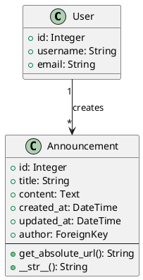
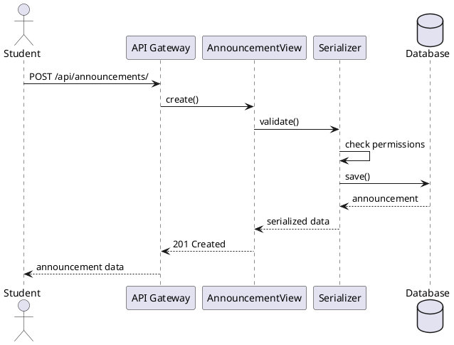

# Documentation Guidelines for PW_hub

## Overview

**CRITICAL**: All code must be properly documented. Documentation is not optional.

## Code Documentation

### 1. Module Docstrings

Every Python file should start with a module docstring that explains the purpose of the module.

```python
"""
Announcement models for the PW_hub application.

This module defines the Announcement model used to represent
student announcements across the university.
"""
```

### 2. Class Docstrings

Every class must have a docstring that explains what the class represents and its purpose.

```python
class Announcement(Model):
    """
    Represents a student announcement in the PW_hub system.

    Announcements are created by students or staff members and
    are displayed in chronological order on the main feed.
    """
```

### 3. Function/Method Docstrings

Complex methods should have docstrings using Google-style format:

```python
def get_user_announcements(user: User, days: int = 30) -> QuerySet:
    """
    Retrieve announcements created by a user within specified days.

    Args:
        user: The user whose announcements to retrieve
        days: Number of days to look back (default: 30)

    Returns:
        QuerySet of Announcement objects

    Raises:
        ValueError: If days is negative
    """
    if days < 0:
        raise ValueError("Days must be non-negative")
    cutoff = timezone.now() - timedelta(days=days)
    return Announcement.objects.filter(author=user, created_at__gte=cutoff)
```

### 4. Inline Comments

Use inline comments sparingly for complex logic only:

- Explain **WHY**, not **WHAT**
- Avoid obvious comments
- Keep comments up to date

```python
# Good - Explains WHY
# Use a longer cache timeout for announcements because they rarely change
cache_timeout = 3600

# Bad - States the obvious
# Set cache timeout to 3600
cache_timeout = 3600
```

## PlantUML Diagrams

### Location

All PlantUML diagrams should be stored in the `docs/diagrams/` directory.

### When to Create Diagrams

1. **Class Diagrams**: For complex model relationships
2. **Sequence Diagrams**: For multi-step processes (e.g., authentication flow)
3. **Component Diagrams**: For system architecture
4. **Use Case Diagrams**: For user interaction flows

### Referencing Existing Diagrams

**IMPORTANT**: Do NOT create your own diagrams. Instead, refer to existing diagrams in `docs/diagrams/`:

- `database.puml` - Original database schema
- `database_new.puml` - Extended database schema
- `use_case.puml` - Use case diagram
- `component_diagram.puml` - Component architecture
- `deployment_diagram.puml` - Deployment architecture
- `app_hierarchy.puml` - Application hierarchy

When documenting:
- Reference existing diagrams instead of creating new ones
- If an existing diagram needs updates, update it rather than creating a new one
- Link to diagrams in documentation: `See docs/diagrams/database_new.puml for the complete schema`

### Creating New Diagrams (Only When Necessary)

If you must create a new diagram:

1. **Check if it already exists** in `docs/diagrams/`
2. **Name it descriptively**: `feature_name_type.puml` (e.g., `authentication_sequence.puml`)
3. **Add to version control**: Commit the `.puml` file
4. **Document it**: Add entry to `docs/diagrams/README.md`

Example class diagram:



Example sequence diagram:



## Project Documentation Structure

The project documentation is organized in the `docs/` directory:

### docs/ Directory Overview

```
docs/
├── conf.py                    # Sphinx configuration
├── index.rst                  # Documentation index
├── docs.md                    # Requirements and implementation concept (Polish)
├── specs.md                   # Functional specification (Polish)
├── howto.rst                  # How-to guides
├── users.rst                  # User documentation
├── Makefile                   # Build documentation
├── make.bat                   # Build documentation (Windows)
├── diagrams/                  # PlantUML diagrams
│   ├── README.md             # Diagrams overview and summary
│   ├── database.puml         # Original database schema
│   ├── database_new.puml     # Extended database schema
│   ├── use_case.puml         # Use case diagram
│   ├── component_diagram.puml # Component architecture
│   ├── deployment_diagram.puml # Deployment architecture
│   ├── app_hierarchy.puml    # Application hierarchy
│   ├── DATABASE_COMPARISON.md # Database schema comparison (English)
│   └── POROWNANIE_BAZ_DANYCH.md # Database schema comparison (Polish)
├── mock/                      # HTML mockups (if any)
└── pycharm/                   # PyCharm-specific docs (if any)
```

### Key Documentation Files

#### docs.md
Contains the high-level requirements and implementation concept for the PW Companion application:
- Project introduction and goals
- Target user groups
- Functional requirements (news, events, maps, USOS integration)
- Non-functional requirements (accessibility, security, scalability)
- Technical concept and architecture
- Project timeline and milestones

#### specs.md
Contains detailed functional specifications:
- User roles (Student, Organizer, Administrator)
- Detailed functionality descriptions
- System requirements
- Use cases and scenarios

#### diagrams/
Contains all architectural and design diagrams:
- Database schemas (original and extended)
- Use case diagrams
- Component and deployment diagrams
- Comparison documents for schema changes

### When to Update Documentation

Update documentation when:

1. **Adding new features**: Document in `docs.md` or `specs.md`
2. **Changing data models**: Update `docs/diagrams/database_new.puml`
3. **Adding use cases**: Update `docs/diagrams/use_case.puml`
4. **Changing architecture**: Update relevant diagram in `docs/diagrams/`
5. **Adding API endpoints**: Document in code with drf-spectacular

## API Documentation

The project uses **drf-spectacular** for OpenAPI/Swagger documentation.

### Documenting API Views

```python
from drf_spectacular.utils import extend_schema, OpenApiParameter
from rest_framework.decorators import action


class AnnouncementViewSet(viewsets.ModelViewSet):
    """
    ViewSet for managing announcements.

    Provides CRUD operations for announcements with filtering
    and search capabilities.
    """

    @extend_schema(
        summary="List all announcements",
        description="Returns a paginated list of all announcements",
        parameters=[
            OpenApiParameter("category", description="Filter by category ID"),
            OpenApiParameter("search", description="Search in title and content"),
        ],
    )
    def list(self, request):
        """List all announcements with optional filtering."""
        pass

    @extend_schema(
        summary="Create a new announcement",
        description="Create a new announcement. Requires authentication.",
    )
    def create(self, request):
        """Create a new announcement."""
        pass
```

### Documenting Serializers

```python
class AnnouncementSerializer(serializers.ModelSerializer):
    """
    Serializer for Announcement model.

    Provides validation and serialization for announcement data.
    """

    author_name = serializers.CharField(
        source="author.username",
        read_only=True,
        help_text="Username of the announcement author"
    )

    class Meta:
        model = Announcement
        fields = ["id", "title", "content", "author", "author_name", "created_at"]
        read_only_fields = ["id", "created_at"]
```

## README Files

### Project README

The main `README.md` should be kept up to date with:
- Project description
- Installation instructions
- Configuration steps
- Common commands
- Contribution guidelines

### App-Specific READMEs

Each app can have its own README in the app directory for:
- App purpose and functionality
- Model descriptions
- API endpoints (if applicable)
- Special considerations

## Translation Documentation

All user-facing strings should be marked for translation:

```python
from django.utils.translation import gettext_lazy as _

# In models
class Meta:
    verbose_name = _("Announcement")
    verbose_name_plural = _("Announcements")

# In views
messages.success(request, _("Announcement created successfully"))

# In templates

```

## Documentation Checklist

Before considering code complete:

- [ ] Module docstrings added
- [ ] Class docstrings added
- [ ] Complex function/method docstrings added
- [ ] Inline comments for complex logic (WHY, not WHAT)
- [ ] PlantUML diagrams created for complex features (or referenced from docs/diagrams/)
- [ ] API endpoints documented with drf-spectacular
- [ ] README updated if needed
- [ ] Translation strings marked with `_()`
- [ ] docs.md or specs.md updated if functionality changed
- [ ] Relevant diagrams in docs/diagrams/ updated

## Building Documentation

To build and view the documentation locally:

```bash
# Build HTML documentation
cd docs
make html

# View documentation
# Open docs/_build/html/index.html in a browser
```

## Tips

1. **Write documentation as you code**: Don't wait until the end
2. **Keep it simple**: Clear and concise is better than verbose
3. **Use examples**: Show don't just tell
4. **Keep it up to date**: Update docs when code changes
5. **Reference existing diagrams**: Don't duplicate what already exists
