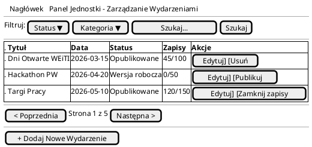
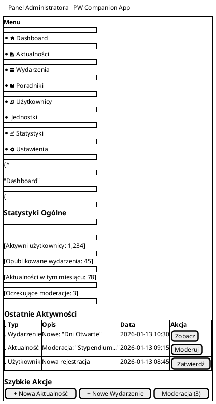
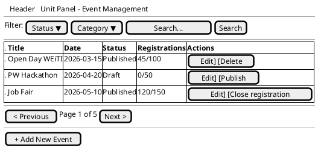
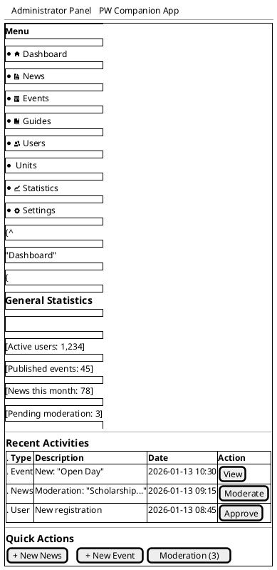

# Dokumentacja Mock-upów / Mock-ups Documentation

## 🇵🇱 Dokumentacja po Polsku

### 1. Zakres Obecnych Mock-upów

**Wszystkie mock-upy znajdujące się w katalogu `docs/mock/` dotyczą wyłącznie aplikacji mobilnej Flutter przeznaczonej dla użytkownika końcowego - studenta.**

#### Lokalizacja
```
docs/mock/
├── index.html          # Strona główna mock-upów
├── home.html           # Ekran główny aplikacji studenckiej
├── news.html           # Lista aktualności
├── events.html         # Lista wydarzeń
├── event-details.html  # Szczegóły wydarzenia
├── event-ticket.html   # Wejściówka na wydarzenie
├── guides.html         # Poradniki
├── map.html            # Mapy kampusu
├── dark.html           # Tryb ciemny
├── eng.html            # Wersja angielska
├── kontrast.html       # Tryb wysokiego kontrastu
└── assets/             # Zasoby graficzne
```

#### Przeznaczenie
- **Platforma**: Flutter (Android + iOS)
- **Grupa docelowa**: Studenci Politechniki Warszawskiej
- **Typ interfejsu**: Aplikacja mobilna
- **Język**: Polski, Angielski
- **Dostępność**: Zgodność z WCAG 2.1

### 2. Mock-upy Paneli Django

#### 2.1 Panel dla Jednostek Organizacyjnych
**Status**: ✅ Mock-upy stworzone

Mock-upy panelu dla jednostek organizacyjnych (panel administracyjny/organizacyjny) są dostępne w `docs/mock_django/unit_panel/`.

##### Wymagania dla Panelu Jednostek

**Technologia i Implementacja:**
- **Framework**: Django (backend)
- **Rendering**: Django Template Language (DTL)
- **Architektura**: Bezpośrednia implementacja w aplikacji Django (bez API)
- **Dostęp**: Bezpośrednie renderowanie szablonów przez Django views
- **Brak warstwy API**: Panel jednostek NIE będzie korzystał z Django REST Framework ani żadnego API - całość logiki i prezentacji będzie zrealizowana bezpośrednio w Django

**Funkcjonalności:**
- Zarządzanie wydarzeniami przez jednostki organizacyjne
- Moderacja aktualności i ogłoszeń
- Przeglądanie statystyk i raportów
- Zarządzanie użytkownikami jednostki
- Konfiguracja uprawnień i widoczności treści

**Architektura Techniczna:**
```
┌─────────────────────────────────────────┐
│   Panel dla Jednostek (Django)          │
│                                          │
│   ┌──────────────────────────────────┐  │
│   │  Django Views (Class-Based)      │  │
│   │  - AnnouncementListView          │  │
│   │  - EventManagementView           │  │
│   │  - StatisticsView                │  │
│   └──────────────────────────────────┘  │
│              ↓                           │
│   ┌──────────────────────────────────┐  │
│   │  Django Templates (DTL)          │  │
│   │  - unit_panel/announcement.html  │  │
│   │  - unit_panel/event_list.html    │  │
│   │  - unit_panel/statistics.html    │  │
│   └──────────────────────────────────┘  │
│              ↓                           │
│   ┌──────────────────────────────────┐  │
│   │  Django ORM                      │  │
│   │  - Bezpośredni dostęp do modeli  │  │
│   └──────────────────────────────────┘  │
└─────────────────────────────────────────┘
              ↓
    ┌──────────────────┐
    │  PostgreSQL DB   │
    └──────────────────┘
```

**Kluczowe różnice w porównaniu do aplikacji Flutter:**
| Aspekt | Aplikacja Flutter | Panel Jednostek |
|--------|-------------------|-----------------|
| Platforma | Mobile (Android/iOS) | Web (przeglądarka) |
| Framework | Flutter + Dart | Django + Python |
| Warstwa danych | REST API (DRF) | Django ORM (bezpośrednio) |
| Rendering | Flutter widgets | Django Templates (DTL) |
| Użytkownicy | Studenci | Pracownicy jednostek |
| Autentykacja | OAuth2/SSO | Django sessions + SSO |

#### 2.2 Panel Administratora Merytorycznego
**Status**: ✅ Mock-upy stworzone

Dedykowany panel dla administratora merytorycznego/organizacyjnego (niekorzystający z Django Admin) jest dostępny w `docs/mock_django/admin_panel/`.

##### Wymagania dla Panelu Administratora Merytorycznego

**Charakterystyka:**
- **Nie Django Admin**: Dedykowany, niestandardowy interfejs zbudowany przy użyciu Django views i templates
- **Technologia**: Django Template Language (DTL), podobnie jak panel jednostek
- **Grupa docelowa**: Administratorzy merytoryczni (nietechniczni) zarządzający treścią
- **Implementacja**: Bezpośrednio w Django (bez API)

**Funkcjonalności:**
- Zaawansowane zarządzanie wszystkimi treściami (wydarzenia, aktualności, poradniki)
- Zarządzanie wszystkimi jednostkami organizacyjnymi
- Przegląd globalnych statystyk
- Moderacja zgłoszeń i raportów
- Konfiguracja systemowa dostępna dla administratorów merytorycznych
- Zarządzanie uprawnieniami użytkowników

**Różnice względem Django Admin:**
| Aspekt | Django Admin | Panel Administratora Merytorycznego |
|--------|--------------|-------------------------------------|
| Interfejs | Standardowy, generyczny | Dedykowany, dostosowany do PW |
| Dostępność | WCAG - ograniczona | WCAG 2.1 - pełna zgodność |
| Język | Polski (+ inne) | Polski + Angielski (dostosowane) |
| UX | Techniczny | Przyjazny dla użytkowników nietechnicznych |
| Funkcje | CRUD + więcej | Tylko potrzebne funkcje biznesowe |
| Customizacja | Ograniczona | Pełna kontrola |

### 3. Wymagania dla Nowych Mock-upów

#### 3.1 Format Mock-upów

**Wszystkie nowe mock-upy muszą być stworzone w formacie PlantUML z wykorzystaniem składni salt/wireframe.**

##### Przykład: Mock-up Listy Wydarzeń dla Panel Jednostek



##### Przykład: Mock-up Dashboard Administratora Merytorycznego



#### 3.2 Zasady Tworzenia Mock-upów w PlantUML Salt

**Podstawowe elementy salt:**

1. **Struktura główna**: `@startsalt ... @endsalt`
2. **Pola tekstowe**: `[  Tekst...  ]`
3. **Przyciski**: `[Przycisk]`
4. **Listy rozwijane**: `[Wybierz ▼]`
5. **Tabele**: 
   ```
   {#
     . Kolumna1 | Kolumna2 | Kolumna3
     . Wartość1 | Wartość2 | Wartość3
   }
   ```
6. **Grupy**: `{ ... }` - dla grupowania elementów
7. **Separatory**: `--` - linia oddzielająca
8. **Menu pionowe**: 
   ```
   {+
     {/ Menu
       * Opcja1
       * Opcja2
     | Zawartość
     }
   }
   ```
9. **Nagłówki**: `{T + Tytuł }`

**Dodatkowe wytyczne:**
- Używaj polskich nazw dla elementów interfejsu
- Zachowaj spójność z istniejącymi wzorcami Django admin
- Uwzględnij elementy dostępności (etykiety, opisy)
- Zaznacz elementy interaktywne
- Dodaj przykładowe dane reprezentatywne dla PW

#### 3.3 Lokalizacja Nowych Mock-upów

Nowe mock-upy powinny być umieszczone w:
```
docs/mock_django/
├── README.md                        # Opis mock-upów Django
├── unit_panel/                      # Mock-upy panelu jednostek
│   ├── unit_panel_overview.puml     # Przegląd panelu
│   ├── event_management.puml        # Zarządzanie wydarzeniami
│   ├── announcement_management.puml # Zarządzanie aktualnościami
│   ├── statistics_view.puml         # Widok statystyk
│   └── user_management.puml         # Zarządzanie użytkownikami jednostki
├── admin_panel/                     # Mock-upy panelu administratora merytorycznego
│   ├── admin_dashboard.puml         # Dashboard administratora
│   ├── content_moderation.puml      # Moderacja treści
│   ├── unit_management.puml         # Zarządzanie jednostkami
│   ├── global_statistics.puml       # Globalne statystyki
│   ├── system_configuration.puml    # Konfiguracja systemu
│   └── permissions_management.puml  # Zarządzanie uprawnieniami
└── common/                          # Wspólne elementy
    ├── navigation.puml              # Nawigacja
    ├── forms.puml                   # Formularze
    └── components.puml              # Komponenty wielokrotnego użytku
```

### 4. Podsumowanie Wymagań

#### ✅ Istniejące Mock-upy
- [x] Aplikacja mobilna Flutter dla studentów (docs/mock/)
- [x] Różne tryby: standardowy, ciemny, kontrast, wielojęzyczność

#### ✅ Mock-upy paneli Django
- [x] Panel dla jednostek organizacyjnych (Django + DTL)
- [x] Panel administratora merytorycznego (Django + DTL, nie Django Admin)

#### 📋 Wymagania Implementacyjne
- [x] Panel jednostek: Django views + templates (bez API)
- [x] Panel administratora: Django views + templates (bez API)
- [x] Format mock-upów: PlantUML salt/wireframe
- [x] Lokalizacja: docs/mock_django/
- [x] Dostępność: WCAG 2.1
- [x] Język: Polski + Angielski

### 5. Architektura Systemu - Diagram Ogólny

```plantuml
@startuml System Architecture Overview
!include https://raw.githubusercontent.com/plantuml-stdlib/C4-PlantUML/master/C4_Container.puml

Person(student, "Student", "Użytkownik końcowy")
Person(unit_staff, "Pracownik Jednostki", "Zarządza treściami jednostki")
Person(admin, "Administrator Merytoryczny", "Zarządza całym systemem")

System_Boundary(pw_hub, "PW_hub System") {
    Container(flutter_app, "Aplikacja Flutter", "Flutter/Dart", "Aplikacja mobilna dla studentów")
    Container(django_web, "Panel Webowy Django", "Django/Python/DTL", "Panel dla jednostek i administratorów")
    Container(api, "REST API", "Django REST Framework", "API dla aplikacji Flutter")
    ContainerDb(db, "Baza Danych", "PostgreSQL", "Przechowuje wszystkie dane")
}

System_Ext(usos, "USOS", "System USOS PW")
System_Ext(sso, "SSO", "Single Sign-On PW")

Rel(student, flutter_app, "Używa", "HTTPS")
Rel(unit_staff, django_web, "Zarządza", "HTTPS")
Rel(admin, django_web, "Administruje", "HTTPS")

Rel(flutter_app, api, "Pobiera dane", "REST/HTTPS")
Rel(django_web, db, "Zapisuje/odczytuje", "Django ORM")
Rel(api, db, "Zapisuje/odczytuje", "Django ORM")

Rel(django_web, sso, "Uwierzytelnia", "OAuth2/SAML")
Rel(flutter_app, sso, "Uwierzytelnia", "OAuth2")
Rel(django_web, usos, "Synchronizuje", "HTTPS")
Rel(api, usos, "Synchronizuje", "HTTPS")

@enduml
```

**Kluczowe elementy architektury:**

1. **Aplikacja Flutter** (docs/mock/)
   - Interfejs mobilny dla studentów
   - Komunikacja przez REST API
   - Mock-upy w formacie HTML

2. **Panel Django - Jednostki** (docs/mock_django/unit_panel/)
   - Interfejs webowy dla pracowników jednostek
   - Bezpośrednia komunikacja z bazą przez Django ORM
   - Brak warstwy API
   - Mock-upy w formacie PlantUML salt

3. **Panel Django - Administrator** (docs/mock_django/admin_panel/)
   - Interfejs webowy dla administratorów merytorycznych
   - Bezpośrednia komunikacja z bazą przez Django ORM
   - Brak warstwy API
   - Nie wykorzystuje Django Admin
   - Mock-upy w formacie PlantUML salt

### 6. Następne Kroki

1. **Analiza wymagań**: Szczegółowa analiza potrzeb panelu jednostek i administratora
2. **Stworzenie mock-upów**: Przygotowanie mock-upów w PlantUML salt/wireframe
3. **Konsultacje**: Weryfikacja mock-upów z użytkownikami (pracownicy jednostek, administratorzy)
4. **Implementacja**: Stworzenie Django views i templates zgodnie z mock-upami
5. **Testowanie**: Testy użyteczności i dostępności
6. **Dokumentacja**: Aktualizacja dokumentacji technicznej

---

## 🇬🇧 English Documentation

### 1. Scope of Current Mock-ups

**All mock-ups located in the `docs/mock/` directory relate exclusively to the Flutter mobile application intended for end users - students.**

#### Location
```
docs/mock/
├── index.html          # Mock-ups homepage
├── home.html           # Student app home screen
├── news.html           # News list
├── events.html         # Events list
├── event-details.html  # Event details
├── event-ticket.html   # Event ticket
├── guides.html         # Guides
├── map.html            # Campus maps
├── dark.html           # Dark mode
├── eng.html            # English version
├── kontrast.html       # High contrast mode
└── assets/             # Graphic resources
```

#### Purpose
- **Platform**: Flutter (Android + iOS)
- **Target audience**: Warsaw University of Technology students
- **Interface type**: Mobile application
- **Language**: Polish, English
- **Accessibility**: WCAG 2.1 compliant

### 2. Django Panel Mock-ups

#### 2.1 Organizational Unit Panel
**Status**: ✅ Mock-ups available

Mock-ups for the organizational unit panel (administrative/organizational panel) are available in `docs/mock_django/unit_panel/`.

##### Requirements for Unit Panel

**Technology and Implementation:**
- **Framework**: Django (backend)
- **Rendering**: Django Template Language (DTL)
- **Architecture**: Direct implementation in Django application (without API)
- **Access**: Direct template rendering through Django views
- **No API layer**: The unit panel will NOT use Django REST Framework or any API - all logic and presentation will be implemented directly in Django

**Functionality:**
- Event management by organizational units
- News and announcements moderation
- Statistics and reports viewing
- Unit user management
- Permissions and content visibility configuration

**Technical Architecture:**
```
┌─────────────────────────────────────────┐
│   Unit Panel (Django)                   │
│                                          │
│   ┌──────────────────────────────────┐  │
│   │  Django Views (Class-Based)      │  │
│   │  - AnnouncementListView          │  │
│   │  - EventManagementView           │  │
│   │  - StatisticsView                │  │
│   └──────────────────────────────────┘  │
│              ↓                           │
│   ┌──────────────────────────────────┐  │
│   │  Django Templates (DTL)          │  │
│   │  - unit_panel/announcement.html  │  │
│   │  - unit_panel/event_list.html    │  │
│   │  - unit_panel/statistics.html    │  │
│   └──────────────────────────────────┘  │
│              ↓                           │
│   ┌──────────────────────────────────┐  │
│   │  Django ORM                      │  │
│   │  - Direct model access           │  │
│   └──────────────────────────────────┘  │
└─────────────────────────────────────────┘
              ↓
    ┌──────────────────┐
    │  PostgreSQL DB   │
    └──────────────────┘
```

**Key differences compared to Flutter application:**
| Aspect | Flutter App | Unit Panel |
|--------|-------------|------------|
| Platform | Mobile (Android/iOS) | Web (browser) |
| Framework | Flutter + Dart | Django + Python |
| Data layer | REST API (DRF) | Django ORM (direct) |
| Rendering | Flutter widgets | Django Templates (DTL) |
| Users | Students | Unit staff |
| Authentication | OAuth2/SSO | Django sessions + SSO |

#### 2.2 Content Administrator Panel
**Status**: ✅ Mock-ups available

A dedicated content/organizational administrator panel (not using Django Admin) is available in `docs/mock_django/admin_panel/`.

##### Requirements for Content Administrator Panel

**Characteristics:**
- **Not Django Admin**: Dedicated, custom interface built using Django views and templates
- **Technology**: Django Template Language (DTL), similar to unit panel
- **Target audience**: Content administrators (non-technical) managing content
- **Implementation**: Direct Django implementation (without API)

**Functionality:**
- Advanced management of all content (events, news, guides)
- Management of all organizational units
- Global statistics overview
- Reports and submissions moderation
- System configuration accessible to content administrators
- User permissions management

**Differences from Django Admin:**
| Aspect | Django Admin | Content Administrator Panel |
|--------|--------------|----------------------------|
| Interface | Standard, generic | Dedicated, customized for PW |
| Accessibility | WCAG - limited | WCAG 2.1 - full compliance |
| Language | Polish (+ others) | Polish + English (customized) |
| UX | Technical | User-friendly for non-technical users |
| Features | CRUD + more | Only needed business features |
| Customization | Limited | Full control |

### 3. Requirements for New Mock-ups

#### 3.1 Mock-up Format

**All new mock-ups must be created in PlantUML format using salt/wireframe syntax.**

##### Example: Event List Mock-up for Unit Panel



##### Example: Content Administrator Dashboard Mock-up



#### 3.2 Rules for Creating Mock-ups in PlantUML Salt

**Basic salt elements:**

1. **Main structure**: `@startsalt ... @endsalt`
2. **Text fields**: `[  Text...  ]`
3. **Buttons**: `[Button]`
4. **Dropdowns**: `[Select ▼]`
5. **Tables**: 
   ```
   {#
     . Column1 | Column2 | Column3
     . Value1 | Value2 | Value3
   }
   ```
6. **Groups**: `{ ... }` - for grouping elements
7. **Separators**: `--` - dividing line
8. **Vertical menu**: 
   ```
   {+
     {/ Menu
       * Option1
       * Option2
     | Content
     }
   }
   ```
9. **Headers**: `{T + Title }`

**Additional guidelines:**
- Use Polish names for interface elements
- Maintain consistency with existing Django admin patterns
- Include accessibility elements (labels, descriptions)
- Mark interactive elements
- Add sample data representative for PW

#### 3.3 Location of Mock-ups

Mock-ups are stored in:
```
docs/mock_django/
├── README.md                        # Django mock-ups description
├── unit_panel/                      # Unit panel mock-ups
│   ├── unit_panel_overview.puml     # Panel overview
│   ├── event_management.puml        # Event management
│   ├── announcement_management.puml # News management
│   ├── statistics_view.puml         # Statistics view
│   └── user_management.puml         # Unit user management
├── admin_panel/                     # Content administrator panel mock-ups
│   ├── admin_dashboard.puml         # Administrator dashboard
│   ├── content_moderation.puml      # Content moderation
│   ├── unit_management.puml         # Unit management
│   ├── global_statistics.puml       # Global statistics
│   ├── system_configuration.puml    # System configuration
│   └── permissions_management.puml  # Permissions management
└── common/                          # Common elements
    ├── navigation.puml              # Navigation
    ├── forms.puml                   # Forms
    └── components.puml              # Reusable components
```

### 4. Requirements Summary

#### ✅ Existing Mock-ups
- [x] Flutter mobile application for students (docs/mock/)
- [x] Various modes: standard, dark, contrast, multilingual

#### ✅ Django Panel Mock-ups
- [x] Organizational unit panel (Django + DTL)
- [x] Content administrator panel (Django + DTL, not Django Admin)

#### 📋 Implementation Requirements
- [x] Unit panel: Django views + templates (without API)
- [x] Administrator panel: Django views + templates (without API)
- [x] Mock-up format: PlantUML salt/wireframe
- [x] Location: docs/mock_django/
- [x] Accessibility: WCAG 2.1
- [x] Language: Polish + English

### 5. Next Steps

1. **Requirements validation**: Confirm mock-ups with unit staff and administrators
2. **Implementation**: Create Django views and templates according to mock-ups
3. **Testing**: Usability and accessibility testing
4. **Documentation**: Update technical documentation during implementation

---

## 📚 References / Referencje

- **Existing documentation / Istniejąca dokumentacja**: 
  - `docs/docs.md` - Requirements and implementation concept
  - `docs/specs.md` - Functional specification
  - `docs/diagrams/README.md` - Database and use case diagrams
  - `agents.md` - Development guidelines

- **Mock-ups / Mock-upy**:
  - `docs/mock/` - Flutter student application mock-ups (HTML)
  - `docs/mock_django/` - Django panel mock-ups (PlantUML)

- **External resources / Zasoby zewnętrzne**:
  - [PlantUML Salt Documentation](https://plantuml.com/salt)
  - [Django Template Language](https://docs.djangoproject.com/en/stable/topics/templates/)
  - [WCAG 2.1 Guidelines](https://www.w3.org/WAI/WCAG21/quickref/)

---

**Status**: ✅ DOCUMENTED / UDOKUMENTOWANE

**Date / Data**: 2026-01-13

**Version / Wersja**: 1.0
