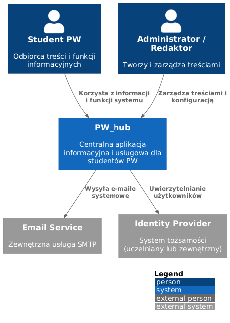
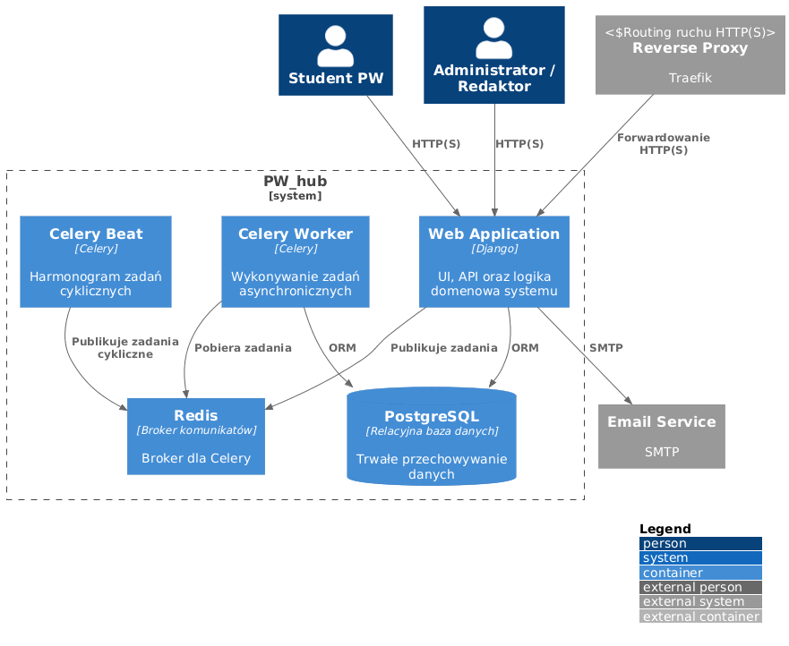
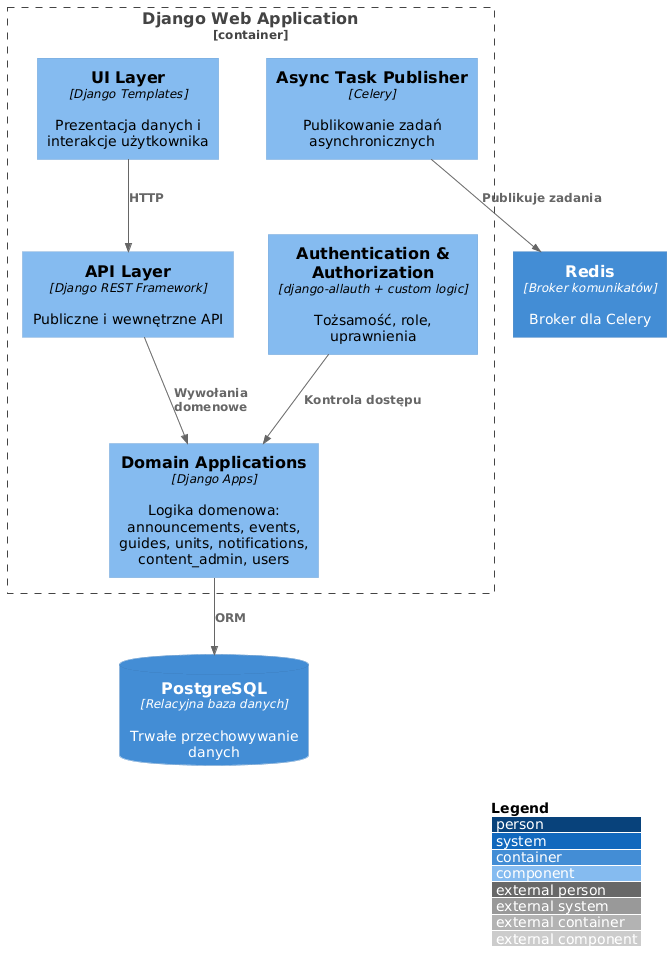

# C4 Model – PW_hub

## Cel i zakres

Ten dokument opisuje architekturę systemu **PW_hub** w ujęciu **C4 (Context, Container, Component)**.

Celem dokumentu jest:
- jednoznaczne określenie **granic systemu**,
- ułatwienie **onboardingu nowych osób**,
- wsparcie **decyzji architektonicznych i refaktoryzacji**,
- zapewnienie spójności pomiędzy **wizją produktu, UX, architekturą i implementacją**.

Diagramy zapisane są w **PlantUML (C4-PlantUML)** i powinny być utrzymywane **razem z kodem oraz dokumentami kontraktowymi projektu**.

Zakres:
- poziomy **C1–C3**,
- brak poziomu Code (C4) — kod i testy są źródłem prawdy.

---

## Poziom 1: System Context (C1)

### Cel

Diagram kontekstowy pokazuje:
- czym jest system **PW_hub**,
- kto z niego korzysta,
- z jakimi systemami zewnętrznymi współpracuje.

Diagram **nie opisuje technologii ani implementacji**.

#### Schemat plantuml

```plantuml
@startuml
!include https://raw.githubusercontent.com/plantuml-stdlib/C4-PlantUML/master/C4_Context.puml

LAYOUT_WITH_LEGEND()

Person(student, "Student PW", "Odbiorca treści i funkcji informacyjnych")
Person(admin, "Administrator / Redaktor", "Tworzy i zarządza treściami")

System(pwHub, "PW_hub", "Centralna aplikacja informacyjna i usługowa dla studentów PW")

System_Ext(emailService, "Email Service", "Zewnętrzna usługa SMTP")
System_Ext(identityProvider, "Identity Provider", "System tożsamości (uczelniany lub zewnętrzny)")

Rel(student, pwHub, "Korzysta z informacji i funkcji systemu")
Rel(admin, pwHub, "Zarządza treściami i konfiguracją")

Rel(pwHub, emailService, "Wysyła e-maile systemowe")
Rel(pwHub, identityProvider, "Uwierzytelnianie użytkowników")

@enduml
```

#### PNG for GitHub/GitLab



---

## Poziom 2: Container Diagram (C2)

### Cel

Diagram kontenerów pokazuje:
- główne **elementy wykonawcze systemu**,
- ich odpowiedzialności,
- sposób komunikacji pomiędzy nimi.

#### Schemat plantuml

```plantuml
@startuml
!include https://raw.githubusercontent.com/plantuml-stdlib/C4-PlantUML/master/C4_Container.puml
LAYOUT_WITH_LEGEND()
Person(student, "Student PW")
Person(admin, "Administrator / Redaktor")
System_Boundary(pwHub, "PW_hub") {
Container(webApp, "Web Application", "Django", "UI, API oraz logika domenowa systemu")
Container(celeryWorker, "Celery Worker", "Celery", "Wykonywanie zadań asynchronicznych")
Container(celeryBeat, "Celery Beat", "Celery", "Harmonogram zadań cyklicznych")
ContainerDb(database, "PostgreSQL", "Relacyjna baza danych", "Trwałe przechowywanie danych")
Container(redis, "Redis", "Broker komunikatów", "Broker dla Celery")
}
System_Ext(reverseProxy, "Reverse Proxy", "Traefik", "Routing ruchu HTTP(S)")
System_Ext(emailService, "Email Service", "SMTP")
Rel(student, webApp, "HTTP(S)")
Rel(admin, webApp, "HTTP(S)")
Rel(reverseProxy, webApp, "Forwardowanie HTTP(S)")
Rel(webApp, database, "ORM")
Rel(webApp, redis, "Publikuje zadania")
Rel(celeryWorker, redis, "Pobiera zadania")
Rel(celeryWorker, database, "ORM")
Rel(celeryBeat, redis, "Publikuje zadania cykliczne")
Rel(webApp, emailService, "SMTP")
@enduml
```

#### PNG for GitHub/GitLab



---

## Poziom 3: Component Diagram – Django Web Application (C3)

### Cel

Diagram komponentów pokazuje **logiczne granice odpowiedzialności** wewnątrz aplikacji Django.

#### Schemat plantuml

```plantuml
@startuml
!include https://raw.githubusercontent.com/plantuml-stdlib/C4-PlantUML/master/C4_Component.puml
LAYOUT_WITH_LEGEND()
Container_Boundary(webApp, "Django Web Application") {
Component(ui, "UI Layer", "Django Templates", "Prezentacja danych i interakcje użytkownika")
Component(api, "API Layer", "Django REST Framework", "Publiczne i wewnętrzne API")
Component(auth, "Authentication & Authorization", "django-allauth + custom logic", "Tożsamość, role, uprawnienia")
Component(domain, "Domain Applications", "Django Apps", "Logika domenowa: announcements, events, guides, units, notifications, content_admin, users")
Component(taskPublisher, "Async Task Publisher", "Celery", "Publikowanie zadań asynchronicznych")
}
ContainerDb(database, "PostgreSQL", "Relacyjna baza danych", "Trwałe przechowywanie danych")
Container(redis, "Redis", "Broker komunikatów", "Broker dla Celery")
Rel(ui, api, "HTTP")
Rel(api, domain, "Wywołania domenowe")
Rel(auth, domain, "Kontrola dostępu")
Rel(domain, database, "ORM")
Rel(taskPublisher, redis, "Publikuje zadania")
@enduml
```

#### PNG for GitHub/GitLab



---

## Zasada utrzymania

> Zmiana, która narusza **Creed of Boundaries**, **Creed of Simplicity**  
> lub powoduje rozmycie komponentów C3,  
> **wymaga aktualizacji tego dokumentu i uzasadnienia w ADR**.
