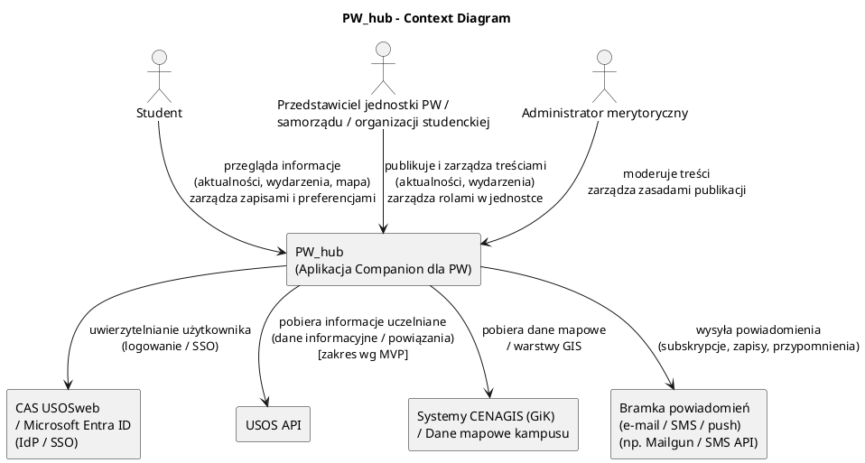
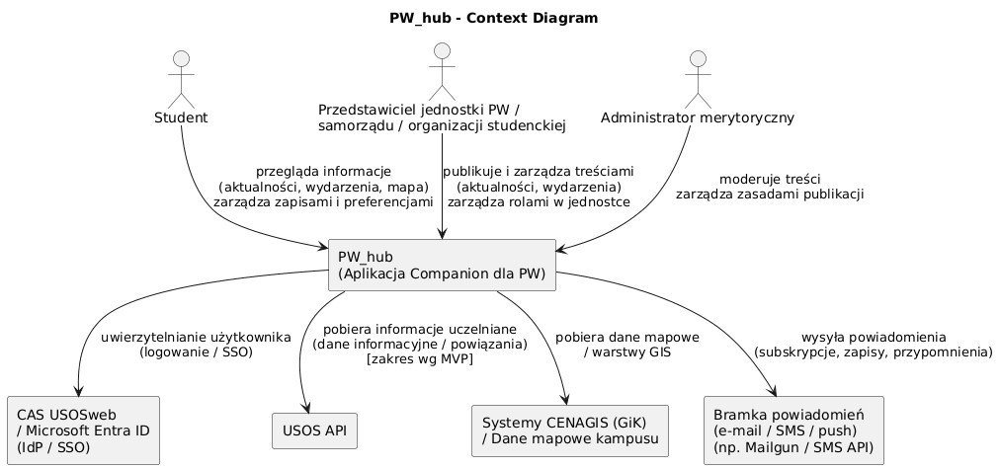

# Context Diagram — PW_hub

## Cel dokumentu
Ten dokument przedstawia **kontekst systemu PW_hub**: głównych użytkowników, granice systemu oraz zależności zewnętrzne, aby ułatwić analizę architektury i komunikacji między komponentami. \
Opis opiera się na wymaganiach i specyfikacji projektu.

## Kontekst systemu

### Schemat PlantUML

### PNG for GitHub/GitLab

## Uwagi
- Aplikacja mobilna komunikuje się z backendem przez REST API.
- Panele webowe są realizowane w Django (DTL) bez warstwy REST API, z bezpośrednim użyciem ORM.
- Integracje zewnętrzne obejmują USOS (tryb informacyjny) oraz systemy mapowe CENAGIS (GIK), przy czym dane mapowe są częściowo utrzymywane lokalnie.
- Logowanie odbywa się przez CAS USOSweb lub Microsoft Entra ID.
