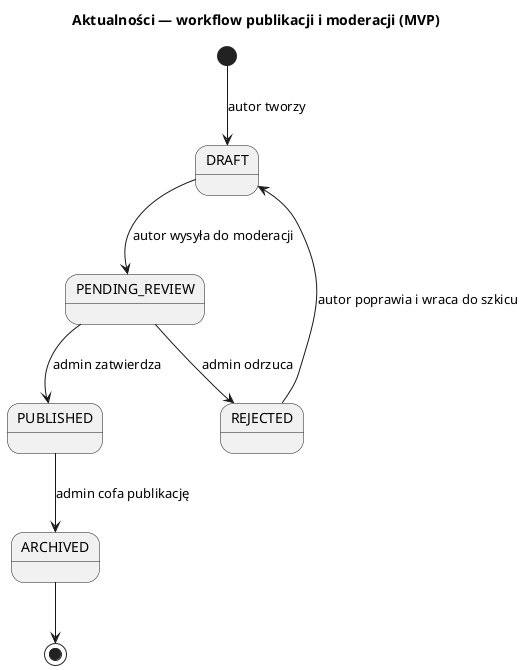

# Zasady publikacji i moderacji aktualności (MVP)

> **Cel**: jednoznaczny kontrakt domenowy publikacji i moderacji aktualności
> pomiędzy jednostkami publikującymi treści (Autor) a Administratorem
> merytorycznym. Dokument jest **decyzyjny**, bez implementacji UI/API.

---

## 1. Problem

W dokumentacji istnieją role Autora i Administratora merytorycznego, ale brak
jednoznacznego workflow akceptacji aktualności. Skutkiem jest ryzyko
publikacji treści niezatwierdzonych, konfliktów kompetencji oraz brak jasnych
blokad publikacji.

**Cel decyzji**: zdefiniować minimalny i kompletny proces publikacji oraz
moderacji, tak aby nie było wątpliwości kto, kiedy i dlaczego może
opublikować lub zablokować treść.

---

## 2. Role i odpowiedzialności

### 2.1 Autor treści (jednostka PW / organizacja studencka)
**Odpowiedzialności w lifecycle aktualności:**
- tworzenie i utrzymanie treści aktualności swojej jednostki,
- przygotowanie treści zgodnej z polityką informacyjną (kompletność, zgodność
  z misją jednostki),
- przekazanie treści do moderacji (zmiana statusu na `PENDING_REVIEW`),
- reagowanie na odrzucenie: korekta i ponowne zgłoszenie.

**Czego NIE może robić:**
- nie może samodzielnie publikować (`PUBLISHED`),
- nie może edytować treści w statusie `PENDING_REVIEW`,
- nie może cofnąć publikacji (zmiana `PUBLISHED` -> inne) — wyłącznie
  Administrator merytoryczny.

### 2.2 Administrator merytoryczny
**Odpowiedzialności w lifecycle aktualności:**
- moderacja treści ze wszystkich jednostek,
- decyzja o publikacji lub odrzuceniu treści,
- możliwość cofnięcia publikacji w przypadku błędów lub niezgodności,
- zapewnienie spójności i wiarygodności informacji w skali uczelni.

**Czego NIE może robić:**
- nie tworzy treści w imieniu Autora (może jedynie korygować oczywiste błędy
  formalne, jeśli to nie zmienia sensu przekazu),
- nie publikuje treści bez przejścia przez status `PENDING_REVIEW`.

---

## 3. Statusy aktualności (minimalny komplet)

| Status | Widoczność publiczna | Kto może zmienić status | Edycja treści | Znaczenie biznesowe |
|---|---|---|---|---|
| `DRAFT` | Nie | Autor | Tak | Szkic roboczy w trakcie przygotowania. |
| `PENDING_REVIEW` | Nie | Autor (wysyła), Administrator (decyzja) | Nie (blokada edycji Autora) | Treść gotowa do moderacji. |
| `PUBLISHED` | Tak | Administrator | Nie (dla Autora) | Treść zatwierdzona i publiczna. |
| `REJECTED` | Nie | Administrator (decyzja), Autor (poprawa → `DRAFT`) | Tak (po powrocie do `DRAFT`) | Odrzucona treść z decyzją admina. |
| `ARCHIVED` | Nie (domyślnie ukryta) | Administrator | Nie (dla Autora) | Treść wycofana/nieaktualna. |

**Uwagi doprecyzowujące:**
- `REJECTED` jest stanem logicznym (może być przechowywany jako status lub
  decyzja administracyjna). W kontrakcie domenowym traktujemy go jako osobny
  status, aby stan decyzji był jednoznaczny.
- `ARCHIVED` oznacza brak widoczności publicznej i brak możliwości edycji
  przez Autora.

---

## 4. Workflow publikacji (krok po kroku)

1. **Utworzenie treści**
   - Autor tworzy aktualność w statusie `DRAFT`.

2. **Przekazanie do moderacji**
   - Autor zmienia status na `PENDING_REVIEW`.
   - Treść jest zamrożona do edycji przez Autora.

3. **Decyzja Administratora**
   - **Zatwierdzenie:** Administrator zmienia status na `PUBLISHED`.
   - **Odrzucenie:** Administrator zmienia status na `REJECTED` i podaje
     uzasadnienie.

4. **Publikacja**
   - Treść jest publicznie widoczna tylko w statusie `PUBLISHED`.

5. **Cofnięcie publikacji**
   - Administrator może zmienić status `PUBLISHED` na `ARCHIVED`.
   - Treść traci widoczność publiczną.

---

## 5. Diagram stanów (tekstowy / PlantUML)

---

## 6. Uprawnienia per rola i per status

### 6.1 Autor
- `DRAFT`: może edytować treść i wysłać do moderacji (`PENDING_REVIEW`).
- `PENDING_REVIEW`: tylko podgląd (brak edycji).
- `PUBLISHED`: tylko podgląd (brak edycji i brak cofania publikacji).
- `REJECTED`: po powrocie do `DRAFT` może edytować i ponownie wysłać.
- `ARCHIVED`: tylko podgląd (brak edycji).

### 6.2 Administrator merytoryczny
- `DRAFT`: brak edycji i brak publikacji (nie ingeruje w robocze treści).
- `PENDING_REVIEW`: może zatwierdzić (`PUBLISHED`) lub odrzucić (`REJECTED`).
- `PUBLISHED`: może cofnąć publikację (`ARCHIVED`).
- `REJECTED`: może pozostawić lub przywrócić do `DRAFT` na prośbę Autora.
- `ARCHIVED`: może przeglądać archiwum (bez ponownej publikacji w MVP).

---

## 7. Kryteria blokady publikacji

Publikacja aktualności jest **blokowana**, gdy:
1. Treść nie ma statusu `PENDING_REVIEW` (brak formalnego zgłoszenia).
2. Administrator merytoryczny nie zatwierdził treści (`PUBLISHED`).
3. Treść została odrzucona (`REJECTED`).
4. Treść została wycofana (`ARCHIVED`).

**Co widzi Autor (stan logiczny):**
- `DRAFT`: „Treść robocza — nieopublikowana”.
- `PENDING_REVIEW`: „Oczekuje na moderację”.
- `REJECTED`: „Odrzucona — wymaga poprawek”.
- `ARCHIVED`: „Wycofana — niewidoczna publicznie”.

---

## 8. Plan testów (QA Witcher style)

1) **Autor tworzy treść i wysyła do moderacji**
- **Given** autor ma uprawnienia do tworzenia aktualności w swojej jednostce
- **When** zapisuje treść jako `DRAFT` i zmienia status na `PENDING_REVIEW`
- **Then** treść jest oznaczona jako „oczekująca na moderację” i nie jest
  publicznie widoczna

2) **Administrator zatwierdza treść → publikacja**
- **Given** aktualność ma status `PENDING_REVIEW`
- **When** administrator zatwierdza treść
- **Then** status zmienia się na `PUBLISHED` i treść staje się publiczna

3) **Administrator odrzuca treść → brak publikacji**
- **Given** aktualność ma status `PENDING_REVIEW`
- **When** administrator odrzuca treść
- **Then** status zmienia się na `REJECTED` i treść pozostaje niepubliczna

4) **Próba publikacji bez akceptacji → blokada**
- **Given** aktualność ma status `DRAFT` lub `PENDING_REVIEW`
- **When** autor próbuje opublikować treść
- **Then** system blokuje publikację (brak przejścia do `PUBLISHED`)

5) **Cofnięcie publikacji przez administratora**
- **Given** aktualność ma status `PUBLISHED`
- **When** administrator cofa publikację
- **Then** status zmienia się na `ARCHIVED` i treść znika z widoku publicznego

6) **Próba edycji treści przez autora po publikacji**
- **Given** aktualność ma status `PUBLISHED`
- **When** autor próbuje edytować treść
- **Then** system blokuje edycję (tylko podgląd)

---

## 9. Notatka: rozstrzygnięcia niejednoznaczności (Product Questmaster)

**Zidentyfikowane niejednoznaczności w specyfikacji:**
- brak jednoznacznej odpowiedzi „kto publikuje”,
- brak formalnego statusu odrzucenia,
- brak definicji blokad publikacji,
- brak reguł cofania publikacji i edycji po publikacji.

**Rozstrzygnięcia:**
- publikować może **wyłącznie Administrator merytoryczny**,
- odrzucenie jest formalnym stanem `REJECTED`,
- publikacja jest możliwa tylko z `PENDING_REVIEW` do `PUBLISHED`,
- autor nie edytuje treści po publikacji — tylko podgląd,
- cofnięcie publikacji jest decyzją Administratora i prowadzi do `ARCHIVED`.

---

## 10. Ryzyka i reguły zapobiegawcze

1) **Publikacja niezatwierdzonych treści**
   - Reguła: `PUBLISHED` tylko po decyzji Administratora.

2) **Konflikt kompetencji autor vs administrator**
   - Reguła: Autor tworzy i zgłasza, Administrator decyduje o publikacji.

3) **Niejasność „kto ma ostatnie słowo”**
   - Reguła: decyzja publikacji/odrzucenia należy wyłącznie do Administratora.

4) **Brak możliwości cofnięcia błędnej publikacji**
   - Reguła: Administrator może przejść `PUBLISHED` -> `ARCHIVED` w każdej
     chwili.
