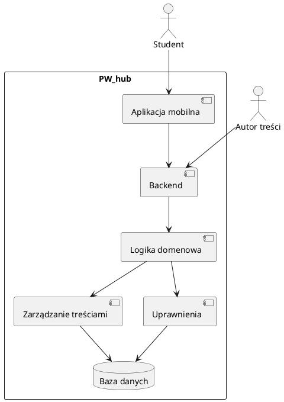

# Analiza Problem Statement — PW_hub

## 1) Problem Statement

Jednostki uczelni oraz organizacje studenckie działające na Politechnice Warszawskiej regularnie publikują informacje skierowane do studentów, takie jak wydarzenia, ogłoszenia, inicjatywy czy materiały informacyjne. Treści te są jednak rozproszone pomiędzy wiele niezależnych kanałów i rozwiązań technicznych, często tworzonych ad hoc i bez wspólnych zasad publikacji.

W praktyce oznacza to, że:
- autorzy treści (np. koła naukowe, samorząd, jednostki PW) nie mają jednego, spójnego miejsca do publikacji informacji,
- sposób udostępniania treści różni się w zależności od źródła,
- brak jest jasnych reguł dotyczących statusu publikacji, wersjonowania i dostępności danych.

Gdy studenci próbują korzystać z tych informacji, napotykają na problemy związane z niespójnością danych, brakiem aktualności lub niejednoznacznym zakresem dostępnych treści. Często ciężko jest znaleźć potrzebne informacje lub zrozumieć, które z nich są oficjalne i aktualne.

W efekcie:
- informacje o wydarzeniach i inicjatywach łatwo giną lub docierają do studentów zbyt późno,
- każda nowa forma prezentacji treści wymaga dodatkowej, powtarzalnej pracy technicznej,
- utrzymanie i rozwój systemu staje się trudny i podatny na błędy.

Problemem nie jest brak funkcji czy narzędzi, lecz **brak jednego, wspólnego i dobrze zdefiniowanego miejsca**, w którym treści uczelniane mogą być publikowane, porządkowane i udostępniane w sposób przewidywalny i możliwy do dalszego rozwoju.

---

## 2) Cel i wartość projektu

- **Cel główny:** stworzenie jednego, spójnego zaplecza technicznego do publikowania i udostępniania treści uczelnianych w ramach PW_hub.
- **Wartość:** łatwiejsze docieranie z informacjami do studentów, uproszczenie publikacji treści oraz stabilna podstawa do budowy kolejnych narzędzi i interfejsów.

---

## 3) Zakres (Scope)

### W zakresie
- Zaprojektowanie i wykonanie aplikacji mobilnej dla studentów (wersja MVP).
- Przygotowanie serwerowego backendu obsługującego aplikację mobilną.
- Jedno centralne źródło treści i danych wykorzystywanych w projekcie PW_hub.
- Interfejs API umożliwiający odczyt i zarządzanie danymi (w zakresie wymaganym przez MVP).
- Jawne zasady publikacji, filtrowania i udostępniania treści.
- Podstawowe mechanizmy uprawnień i kontroli dostępu.
- Dokumentacja techniczna oraz testy automatyczne dla kluczowych elementów systemu.

### Poza zakresem (na teraz)
- Rozbudowane funkcjonalności wykraczające poza potrzeby pierwszej wersji aplikacji.
- Integracje z zewnętrznymi systemami, które nie są niezbędne do działania MVP.
- Zaawansowane narzędzia administracyjne i analityczne niewymagane w pierwszym etapie.
- Funkcje tworzone wyłącznie pod potrzeby jednej jednostki lub organizacji, bez wartości wspólnej.

---

## 4) Użytkownicy i interesariusze

### Kluczowi interesariusze (rola zbliżona do Product Ownera)

- **Samorząd Studentów PW**
  
  Jeden z głównych autorów treści publikowanych w systemie.  
  Reprezentuje perspektywę studentów oraz potrzeby komunikacyjne środowiska studenckiego.  
  Uczestniczy w kształtowaniu funkcjonalności aplikacji i sposobu prezentacji treści.

- **Biuro Komunikacji i Promocji PW**
  
  Główny interesariusz projektu oraz docelowy administrator merytoryczny systemu.  
  Odpowiada za znaczną część oficjalnych treści uczelnianych oraz ich spójność i jakość.  
  W praktyce pełni rolę właściciela merytorycznego rozwiązania i jednego z głównych punktów odniesienia przy podejmowaniu decyzji projektowych.

---

### Administratorzy docelowi systemu

- **Centrum Informatyzacji PW**  
  
  Docelowy administrator techniczny systemu.  
  Odpowiedzialne za utrzymanie, hosting oraz dalsze funkcjonowanie aplikacji jako systemu uczelnianego po zakończeniu etapu projektowego.  
  Interesariusz kluczowy z punktu widzenia zgodności z infrastrukturą i standardami IT PW.

---

### Właściciele i dostawcy danych

- **Wydział Geodezji i Kartografii PW**  
  
  Właściciel danych mapowych wykorzystywanych w aplikacji.  
  Odpowiada za merytoryczną poprawność oraz zakres danych przestrzennych używanych w projekcie.

---

### Autorzy treści (pozostali)

- **Jednostki PW oraz organizacje studenckie**  
  
  Korzystają z gotowego systemu do publikowania i aktualizacji treści.  
  Nie uczestniczą bezpośrednio w procesie projektowym, lecz są istotnymi użytkownikami końcowymi systemu od strony publikacji informacji.

---

### Użytkownicy końcowi

- **Studenci Politechniki Warszawskiej**  
  
  Odbiorcy treści publikowanych w aplikacji mobilnej.  
  Korzystają z systemu w celu uzyskania informacji o wydarzeniach, inicjatywach i życiu uczelni.

---

### Zespół realizujący i wsparcie projektu

- **Zespół projektowy**  
  
  Odpowiedzialny za zaprojektowanie, implementację i testowanie aplikacji mobilnej oraz backendu.

- **Koło Naukowe Inżynierii Oprogramowania**  
  
  Wsparcie merytoryczne i techniczne przy tworzeniu aplikacji.  
  Udział konsultacyjny oraz pomoc w wybranych obszarach rozwoju systemu.

- **Mentorzy i Opiekun projektu**  
  
  Wsparcie merytoryczne i organizacyjne.  
  Nadzór nad realizacją projektu oraz pomoc w podejmowaniu kluczowych decyzji projektowych.

## 5) Wymagania funkcjonalne (wysokopoziomowe)

- Aplikacja mobilna umożliwia studentom przeglądanie aktualnych informacji, wydarzeń i treści uczelnianych.
- System umożliwia autorom treści (np. jednostkom PW, organizacjom studenckim) publikowanie i aktualizowanie informacji.
- Treści mogą być filtrowane według ustalonych kryteriów, takich jak status publikacji lub kontekst (np. język).
- Aplikacja mobilna korzysta ze wspólnego zaplecza serwerowego, które udostępnia dane w sposób spójny i przewidywalny.
- Sposób działania aplikacji i zaplecza jest opisany w dokumentacji technicznej.

---

## 6) Wymagania niefunkcjonalne

- **Niezawodność:** aplikacja i backend zachowują się w sposób jednoznaczny, a błędy są obsługiwane w czytelny sposób.
- **Rozszerzalność:** architektura umożliwia stopniowe dodawanie nowych funkcji po zakończeniu etapu MVP.
- **Bezpieczeństwo:** dostęp do treści nieopublikowanych jest ograniczony zgodnie z ustalonymi zasadami.
- **Użyteczność:** aplikacja mobilna jest czytelna i możliwa do użytkowania bez dodatkowych instrukcji.
- **Testowalność:** kluczowe elementy systemu są objęte testami, umożliwiającymi bezpieczny rozwój projektu.

---

## 7) Ograniczenia i założenia

- Domyślnie użytkownik aplikacji widzi wyłącznie treści opublikowane.
- Aplikacja mobilna oraz backend są projektowane równolegle, jako spójny system.
- Pierwsza wersja projektu koncentruje się na podstawowych potrzebach studentów i autorów treści.
- Dokumentacja i testy są traktowane jako integralna część projektu, a nie dodatek na późniejszym etapie.

---

## 8) Kryteria akceptacji

- Istnieje działająca aplikacja mobilna w wersji MVP.
- Aplikacja poprawnie wyświetla treści publikowane w systemie.
- Mechanizmy publikacji i filtrowania treści działają zgodnie z przyjętymi zasadami.
- Kluczowe elementy backendu oraz aplikacji są objęte testami.
- Dokumentacja umożliwia dalszy rozwój projektu bez konieczności odtwarzania wiedzy projektowej.

---

## 9) Ryzyka i niepewności

- **Rozrost zakresu:** dokładanie funkcji, które nie są niezbędne w pierwszej wersji aplikacji.
- **Przeciążenie zespołu:** zbyt szeroki zakres w stosunku do trzyosobowego zespołu realizującego projekt.
- **Niespójność treści:** brak jasno określonych zasad publikacji i aktualizacji informacji.
- **Zależność od założeń:** potrzeby użytkowników mogą różnić się od przyjętych na początku projektu.

---

## 10) Model systemu (PlantUML — poziom systemowy)

### Schemat PlantUML

### PNG for GitHub/GitLab

---

## 11) Otwarte pytania

- Jakie funkcje aplikacji są absolutnie niezbędne w pierwszej wersji projektu?
- Czy obsługa wielu języków jest wymagana już w MVP, czy w kolejnych etapach?
- Jak w praktyce ma wyglądać proces publikacji i aktualizacji treści?
- Jakie role mają mieć dostęp do treści nieopublikowanych?

---

## 12) Propozycja dalszych kroków

- Doprecyzowanie zakresu pierwszej wersji aplikacji mobilnej (MVP).
- Określenie najważniejszych scenariuszy użycia dla studentów i autorów treści.
- Ustalenie jasnych zasad publikacji, aktualizacji i archiwizacji treści.
- Przygotowanie planu rozwoju projektu po zakończeniu etapu MVP.
