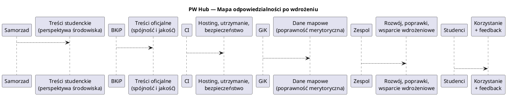
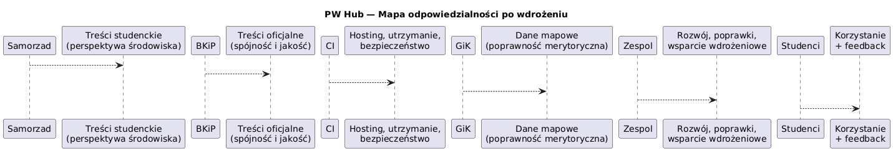

# Stakeholder Analysis — PW Hub

## 1. Cel analizy

Celem analizy interesariuszy jest:

- identyfikacja podmiotów mających realny wpływ na sukces projektu PW Hub,
- określenie ich interesów, decyzyjności i potencjalnych ryzyk,
- zaplanowanie sposobu współpracy i komunikacji,
- zapewnienie, że kluczowe Jobs To Be Done mają **właściciela decyzyjnego**.

Analiza ma charakter **decyzyjny**, a nie opisowy.

---

## 2. Zakres i założenia

- Analiza dotyczy etapu projektowego oraz docelowego funkcjonowania PW Hub jako systemu uczelnianego.
- Użytkownicy końcowi (studenci) są opisani jako **beneficjenci**, a nie decydenci.
- Interesariusze są identyfikowani na poziomie **jednostek / ról instytucjonalnych**, nie osób.
- Poziomy wpływu i zainteresowania są oceniane **realistycznie**, zgodnie z praktyką PW.

---

## 3. Klasyfikacja interesariuszy

### 3.1 Kluczowi interesariusze (rola zbliżona do Product Ownera)

#### Samorząd Studentów PW

- **Rola**: współwłaściciel wizji produktowej (perspektywa studencka)
- **Interes**: skuteczna komunikacja ze studentami, realna adopcja systemu
- **Wpływ**: wysoki
- **Decyzyjność**: współdecydowanie o funkcjach i prezentacji treści
- **Ryzyka**: brak akceptacji → niska adopcja
- **Strategia**: ścisła współpraca, konsultacje roadmapy, iteracyjny feedback

---

#### Biuro Komunikacji i Promocji PW

- **Rola**: główny właściciel merytoryczny systemu
- **Interes**: spójność, jakość i kontrola oficjalnych treści uczelnianych
- **Wpływ**: bardzo wysoki
- **Decyzyjność**: strategiczna i operacyjna
- **Ryzyka**: przeciążenie obowiązkami, blokada decyzji
- **Strategia**: jasne zakresy odpowiedzialności, decyzje asynchroniczne

---

### 3.2 Administratorzy docelowi systemu

#### Centrum Informatyzacji PW

- **Rola**: administrator techniczny i właściciel infrastruktury
- **Interes**: bezpieczeństwo, stabilność, zgodność ze standardami IT PW
- **Wpływ**: bardzo wysoki
- **Decyzyjność**: techniczna i wdrożeniowa
- **Ryzyka**: brak zgody na hosting lub integracje
- **Strategia**: wczesne konsultacje architektury i decyzji technologicznych

---

### 3.3 Właściciele i dostawcy danych

#### Wydział Geodezji i Kartografii PW

- **Rola**: właściciel danych mapowych
- **Interes**: poprawność i właściwe użycie danych przestrzennych
- **Wpływ**: średni
- **Decyzyjność**: merytoryczna (zakres i jakość danych)
- **Ryzyka**: ograniczenia licencyjne, nieaktualne dane
- **Strategia**: formalne uzgodnienia zakresu danych

---

### 3.4 Autorzy treści (pozostali)

#### Jednostki PW i organizacje studenckie

- **Rola**: autorzy treści w systemie
- **Interes**: łatwa publikacja i widoczność informacji
- **Wpływ**: niski–średni
- **Decyzyjność**: brak (operacyjna)
- **Ryzyka**: niska jakość lub brak aktualizacji treści
- **Strategia**: proste procesy publikacji, jasne wytyczne jakości

---

### 3.5 Użytkownicy końcowi

#### Studenci Politechniki Warszawskiej

- **Rola**: odbiorcy treści
- **Interes**: szybki dostęp do istotnych informacji
- **Wpływ**: niski (pośredni przez adopcję)
- **Decyzyjność**: brak
- **Ryzyka**: brak zainteresowania → brak wartości projektu
- **Strategia**: testy użyteczności, walidacja JTBD

---

### 3.6 Zespół realizujący i wsparcie

#### Zespół projektowy

- **Rola**: projektowanie, implementacja, testy
- **Wpływ**: operacyjny
- **Decyzyjność**: wykonawcza
- **Strategia**: jasne priorytety i zakres MVP

#### Koło Naukowe Inżynierii Oprogramowania

- **Rola**: wsparcie techniczne i konsultacyjne
- **Wpływ**: niski
- **Decyzyjność**: doradcza

#### Mentorzy i Opiekun projektu

- **Rola**: nadzór merytoryczny i organizacyjny
- **Wpływ**: średni
- **Decyzyjność**: opiniująca
- **Strategia**: konsultacje kluczowych decyzji

---

## 4. RACI — odpowiedzialność za kluczowe obszary

RACI służy tu **wyłącznie** do rozdzielenia odpowiedzialności między kluczowych interesariuszy instytucjonalnych.
Nie opisuje struktury zespołu projektowego, tylko **własność decyzji i utrzymania**.

| Obszar / Decyzja                          | Samorząd Studentów PW | BKiP PW | Centrum Informatyzacji PW | Zespół projektowy | GiK PW | Studenci |
|-------------------------------------------|-----------------------|---------|---------------------------|-------------------|--------|----------|
| Wizja produktu i kierunek rozwoju         | A                     | A       | C                         | R                 | I      | I        |
| Zakres funkcjonalny (MVP / kolejne etapy) | A                     | A       | C                         | R                 | I      | I        |
| Treści oficjalne uczelni                  | C                     | A       | I                         | R                 | I      | I        |
| Treści studenckie                         | A                     | C       | I                         | R                 | I      | I        |
| Dane mapowe                               | I                     | I       | C                         | R                 | A      | I        |
| Architektura techniczna                   | I                     | C       | A                         | R                 | I      | I        |
| Hosting i utrzymanie produkcyjne          | I                     | C       | A                         | R                 | I      | I        |
| Testy i walidacja z użytkownikami         | C                     | C       | I                         | R                 | I      | C        |

Legenda:

- **A (Accountable)** – ponosi ostateczną odpowiedzialność
- **R (Responsible)** – wykonuje pracę
- **C (Consulted)** – konsultowany
- **I (Informed)** – informowany

---

## 5. Macierz wpływ–zainteresowanie (Power–Interest Matrix)

Macierz pokazuje **jak intensywnie należy pracować z danym interesariuszem**,
a nie „jak ważny jest w teorii”.

### PW Hub — Macierz wpływ–zainteresowanie (Power–Interest Matrix)

|                  | **Wysokie zainteresowanie**                                              | **Niskie zainteresowanie**                                                        |
|------------------|--------------------------------------------------------------------------|-----------------------------------------------------------------------------------|
| **Wysoki wpływ** | **Zarządzaj blisko** • Samorząd Studentów PW                          | **Monitoruj** • Biuro Komunikacji i Promocji PW • Centrum Informatyzacji PW |
| **Niski wpływ**  | **Informuj** • Studenci PW • Jednostki PW i organizacje studenckie | **Minimalny wysiłek** • Wydział Geodezji i Kartografii PW                      |

**Oś X:** zainteresowanie interesariusza  
**Oś Y:** wpływ interesariusza na powodzenie projektu

---

## 6. Mapa odpowiedzialności po wdrożeniu

Mapa odpowiedzialności pokazuje **kto za co odpowiada po zakończeniu projektu**,
co jest kluczowe z punktu widzenia trwałości rozwiązania.

### Schemat PlantUML

### PNG for GitHub/GitLab

---

## 7. Kluczowe ryzyka interesariuszy

- **Brak zgody Centrum Informatyzacji PW**  
  → brak możliwości wdrożenia systemu jako oficjalnego rozwiązania uczelni.

- **Przeciążenie Biura Komunikacji i Promocji PW**  
  → spadek jakości lub aktualności treści.

- **Brak realnej adopcji przez studentów**  
  → brak wartości projektu mimo poprawnej realizacji technicznej.

- **Niejasny podział odpowiedzialności po wdrożeniu**  
  → chaos operacyjny i szybka degradacja systemu.

---

## 8. Wnioski końcowe

- PW Hub nie ma jednego klasycznego Product Ownera — **własność produktu jest współdzielona**.
- Decyzje produktowe wymagają **koordynacji interesariuszy merytorycznych i technicznych**.
- Stakeholder Analysis jest bezpośrednio powiązana z:
    - zakresem MVP,
    - kolejnością funkcjonalności,
    - realnością wdrożenia jako systemu uczelnianego.
- Analiza ta stanowi **podstawę do dalszych decyzji architektonicznych i organizacyjnych**.
