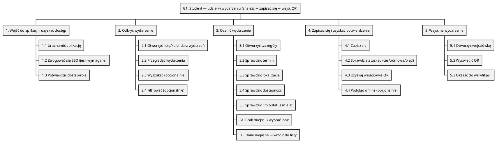
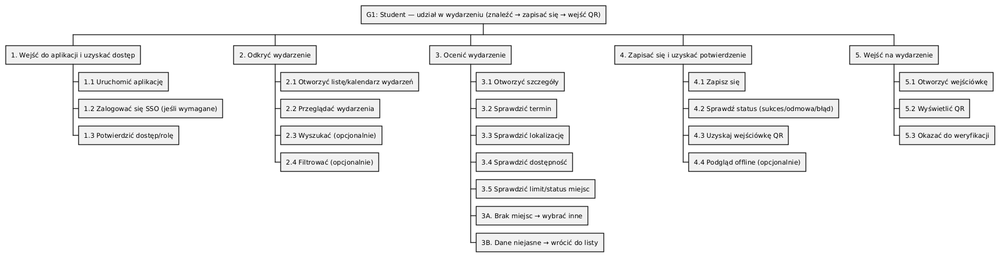
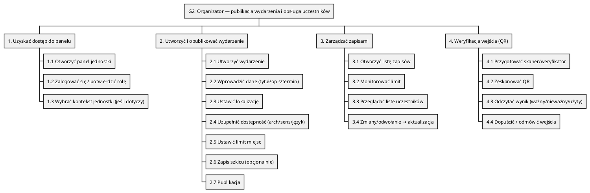
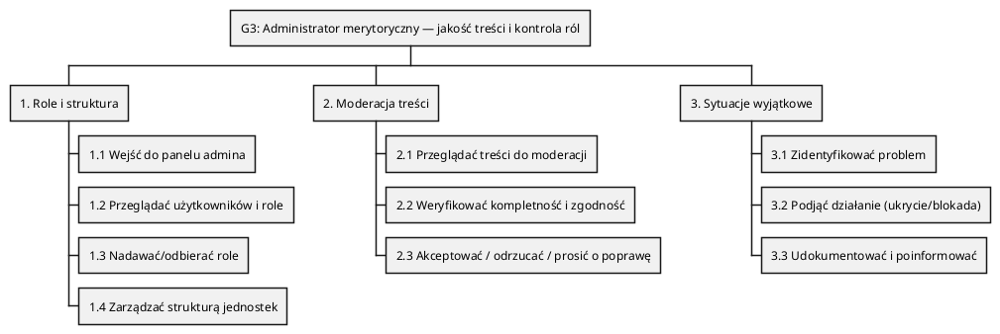

# TODO: Task Analysis / Hierarchical Task Analysis (HTA) — PW_hub

## 1. Kontekst i rola dokumentu
Dokument opisuje **Task Analysis / HTA** dla kluczowych ról i ścieżek MVP PW_hub:
- **Student** (aplikacja mobilna Flutter),
- **Organizator / Pracownik jednostki** (panel Django DTL),
- **Administrator merytoryczny** (panel Django DTL).

HTA opisuje **pracę użytkownika (co i w jakiej kolejności robi)**, a nie UI, backend czy implementację.
Jest to artefakt wspierający:
- projekt UX (flow, copy, dostępność),
- definiowanie backlogu (User Stories),
- testy (AC / Gherkin),
- ochronę zakresu MVP.

Źródła prawdy:
- `docs/specs.md` (funkcje i role),
- `docs/user-stories.md`,
- `docs/user-journey-map.md`,
- `docs/moscow.md`,
- `docs/acceptance-criteria-analysis.md`,
- `docs/problem_statement_analysis.md`.

---

## 2. Cel
Dostarczyć czytelną, ustrukturyzowaną analizę celów i zadań użytkowników dla MVP,
tak aby:
- dało się ją mapować na User Stories i AC,
- była stabilnym artefaktem do iteracji w IDE,
- pomagała wykrywać brakujące kroki, warianty i punkty ryzyka.

---

## 3. Zakres i zasady
- HTA obejmuje **MVP**, w którym jedynym modułem „write-enabled” dla Studenta są **wydarzenia** (zapisy/wejściówki).  
- Integracje zewnętrzne są **informacyjne** (read-only) i nie mogą blokować podstawowej ścieżki MVP.
- Dostępność (WCAG 2.1) jest wymaganiem przekrojowym dla wszystkich kroków krytycznych.

---

## 4. Cele i HTA

### 4.1 Student — Goal G1
**G1:** Znaleźć interesujące wydarzenie, zapisać się na nie i bezproblemowo wejść na wydarzenie (QR).

#### Plan G1 (wysoki poziom)
**Plan G1:** Wykonaj 1 → 2 → 3 → 4.  
Jeśli na etapie 3 wystąpi błąd lub brak miejsc → zastosuj warianty 3A/3B.

#### HTA — Student (G1)
1. **Wejść do aplikacji i uzyskać dostęp**
   1.1 Uruchomić aplikację
   1.2 Zalogować się SSO (jeśli wymagane)
   1.3 Upewnić się, że użytkownik ma dostęp do treści (rola Student)

2. **Odkryć wydarzenie**
   2.1 Otworzyć moduł wydarzeń (lista/kalendarz)
   2.2 Przeglądać wydarzenia
   2.3 Wyszukać wydarzenie (opcjonalnie)
   2.4 Zastosować filtry (kategoria/język/dostępność) (opcjonalnie)

3. **Ocenić wydarzenie i podjąć decyzję**
   3.1 Otworzyć szczegóły wydarzenia
   3.2 Sprawdzić termin i czas trwania
   3.3 Sprawdzić lokalizację
   3.4 Sprawdzić informacje o dostępności (architektoniczna/sensoryczna/język)
   3.5 Sprawdzić status miejsc (limit, dostępność zapisu)
   3A. (Wariant) Brak miejsc → zrezygnować / wybrać inne wydarzenie
   3B. (Wariant) Dane niepełne / niejasne → wrócić do listy i wybrać inne

4. **Zapisać się i uzyskać potwierdzenie**
   4.1 Wybrać akcję „Zapisz się”
   4.2 Otrzymać jednoznaczny status zapisu (sukces/odmowa/błąd)
   4.3 Uzyskać wejściówkę QR (w aplikacji)
   4.4 (Opcjonalnie) Pobrać / zapewnić podgląd offline wejściówki

5. **Wejść na wydarzenie**
   5.1 Otworzyć listę swoich wejściówek / zapisanego wydarzenia
   5.2 Wyświetlić kod QR
   5.3 Okazać kod do weryfikacji przy wejściu
   5.4 Otrzymać informację, że wejście jest poprawne (po stronie organizatora)

---

### 4.2 Organizator — Goal G2
**G2:** Opublikować wydarzenie, zarządzać zapisami i zweryfikować uczestników (QR).

#### Plan G2 (wysoki poziom)
**Plan G2:** Wykonaj 1 → 2 → 3.  
W dniu wydarzenia wykonaj 4 (operacyjnie).

#### HTA — Organizator (G2)
1. **Uzyskać dostęp do panelu**
   1.1 Wejść do panelu jednostki (Django DTL)
   1.2 Zalogować się / potwierdzić uprawnienia (rola Organizator)
   1.3 Wybrać jednostkę/kontekst, jeśli dotyczy

2. **Utworzyć i opublikować wydarzenie**
   2.1 Rozpocząć tworzenie wydarzenia
   2.2 Wprowadzić podstawowe dane (tytuł, opis, termin)
   2.3 Wskazać lokalizację
   2.4 Uzupełnić informacje o dostępności (architektoniczna/sensoryczna/język)
   2.5 Ustawić limit miejsc i zasady zapisów
   2.6 Zapisać szkic (opcjonalnie, jeśli istnieje workflow publikacji)
   2.7 Opublikować wydarzenie (zmiana statusu na widoczny dla studentów)

3. **Zarządzać zapisami i listą uczestników**
   3.1 Otworzyć widok zapisów wydarzenia
   3.2 Monitorować liczbę zapisów vs limit miejsc
   3.3 Przeglądać listę uczestników
   3.4 (Wariant) Odwołanie / zmiana szczegółów → zaktualizować wydarzenie i komunikację

4. **Zweryfikować uczestników przy wejściu (QR)**
   4.1 Przygotować narzędzie skanowania / weryfikacji
   4.2 Zeskanować kod QR uczestnika
   4.3 Otrzymać wynik weryfikacji (ważny/nieważny/użyty wcześniej)
   4.4 W przypadku ważnego kodu → dopuścić wejście
   4.5 W przypadku problemu → zastosować procedurę obsługi (odmowa / wyjaśnienie)

---

### 4.3 Administrator merytoryczny — Goal G3
**G3:** Utrzymać jakość i spójność treści oraz kontrolę ról/uprawnień w skali systemu.

#### Plan G3 (wysoki poziom)
**Plan G3:** Cyklicznie 1–2. Dla incydentów wykonaj 3.

#### HTA — Administrator merytoryczny (G3)
1. **Zarządzać rolami i strukturą**
   1.1 Wejść do panelu admina merytorycznego
   1.2 Przeglądać użytkowników i role
   1.3 Nadawać/odbierać role (zgodnie z polityką)
   1.4 Zarządzać strukturą jednostek (organizacyjnie)

2. **Moderować treści**
   2.1 Przeglądać treści do moderacji
   2.2 Sprawdzać kompletność i zgodność treści (w tym dostępność informacji)
   2.3 Akceptować / odrzucać / prosić o poprawę (jeśli workflow istnieje)

3. **Obsłużyć sytuacje wyjątkowe**
   3.1 Zidentyfikować problem (np. naruszenie zasad, błędne treści)
   3.2 Podjąć działanie (ukrycie, korekta, blokada uprawnień)
   3.3 Udokumentować decyzję i poinformować interesariuszy

---

## 5. Kryteria akceptacji dokumentu HTA (artefakt)
- Plik znajduje się w `docs/analysis/`.
- Zawiera cele G1–G3 oraz hierarchię zadań z numeracją.
- Zawiera plany (Plan G1/G2/G3) i warianty (co najmniej dla błędów/braku miejsc).
- Zawiera diagramy WBS w PlantUML dla co najmniej G1 i G2.

---

## 6. Diagramy PlantUML — WBS

### 6.1 WBS — Student (G1)

#### Schemat PlantUML

#### PNG for GitHub/GitLab

### 6.2 WBS — Organizator (G2)

#### Schemat PlantUML

#### PNG for GitHub/GitLab

### 6.3 WBS — Administrator merytoryczny (G3)

#### Schemat PlantUML

#### PNG for GitHub/GitLab

---

## 7. Uwagi do utrzymania

- Każda nowa funkcja w MVP powinna dać się dopisać jako:
  - nowy krok w G1/G2/G3 **albo** 
  - nowy goal, jeśli to nowa „praca użytkownika”. 
- Warianty (A/B/…) dodawaj w miejscach, gdzie:
  - jest decyzja użytkownika, 
  - jest ryzyko błędu integracji, 
  - pojawia się limit lub brak dostępności.
- Przy zmianie User Stories / AC aktualizuj odpowiadające kroki w HTA (mapowanie 1:N).
