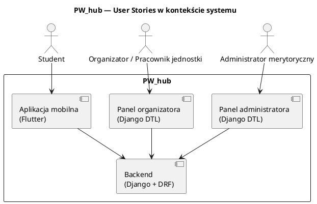

# Analiza User Stories — PW_hub

## 1. Cel dokumentu

Celem dokumentu jest zdefiniowanie **User Stories dla MVP PW_hub**
w sposób:

- spójny z JTBD i Problem Statement,
- możliwy do bezpośredniego przełożenia na backlog,
- chroniący zakres projektu przed scope creep.

User Stories opisują **perspektywę użytkownika i wartość**,
a nie rozwiązania techniczne.

---

## 2. Kontekst i założenia systemowe

- System obejmuje:
    - aplikację mobilną **Flutter** dla studentów,
    - panele webowe **Django (DTL)** dla organizatorów i administratorów merytorycznych.
- Integracje zewnętrzne (np. **USOS**) są **wyłącznie w trybie odczytu**.
- System nie zastępuje istniejących narzędzi uczelnianych.
- **Wielojęzyczność (MVP Strategy):**
    - Interfejs (UI) aplikacji mobilnej i paneli jest w pełni dwujęzyczny (PL/EN).
    - Treści (News/Events) są tworzone w jednym języku, ale posiadają atrybut języka (PL/EN) umożliwiający filtrowanie.
- Wymagania **dostępności (WCAG 2.1)**, **bezpieczeństwa** i **RODO**
  są kryteriami przekrojowymi dla wszystkich User Stories.

---

## 3. Role (Persony operacyjne)

### Student

- Korzysta z aplikacji mobilnej.
- Przegląda aktualności i wydarzenia.
- Zapisuje się na wydarzenia i korzysta z wejściówek QR.
- Używa mapy kampusu i otrzymuje powiadomienia.

### Organizator / Pracownik jednostki

- Korzysta z panelu webowego Django.
- Tworzy i zarządza wydarzeniami oraz aktualnościami swojej jednostki.
- Zarządza zapisami i weryfikuje uczestników.

### Administrator merytoryczny

- Korzysta z panelu webowego Django.
- Moderuje treści, zarządza rolami i strukturą jednostek.
- Odpowiada za spójność i jakość treści w skali całej uczelni.

---

## 4. Powiązanie User Stories z systemem (schemat)

### Schemat PlantUML

### PNG for GitHub/GitLab

---

## 5. Backlog User Stories — MVP

User Stories opisują **minimalny zakres funkcjonalny**, który realizuje
kluczowe JTBD projektu PW_hub i jest realistyczny do wdrożenia w ramach MVP.

Brak User Story oznacza **świadomy Non-Goal**, a nie lukę w analizie.

---

### 5.1 Student (aplikacja mobilna)

| ID     | User Story                                                                                                                                  | Priorytet |
|--------|---------------------------------------------------------------------------------------------------------------------------------------------|-----------|
| STU-01 | Jako **Student** chcę zalogować się przez uczelniane SSO, aby korzystać z aplikacji bez zakładania lokalnego konta.                         | Deferred (ADR-003) |
| STU-12 | Jako **Student** chcę szybko uzupełnić profil (wydział, rok, grupa opcjonalnie), aby widzieć treści dopasowane do mojego kontekstu.        | Must      |
| STU-02 | Jako **Student** chcę przeglądać aktualności uczelniane i organizacyjne, aby być na bieżąco z ważnymi informacjami.                         | Must      |
| STU-03 | Jako **Student** chcę filtrować aktualności po kategoriach, aby szybciej znaleźć interesujące mnie treści.                                  | Should    |
| STU-04 | Jako **Student** chcę przeglądać wydarzenia w widoku listy (chronologicznie), aby zaplanować swój czas.                                     | Must      |
| STU-05 | Jako **Student** chcę filtrować wydarzenia (wydział/jednostka, kategoria, zakres dat), aby znaleźć wydarzenia dopasowane do moich potrzeb.  | Must      |
| STU-06 | Jako **Student** chcę zobaczyć szczegóły wydarzenia (opis, data, lokalizacja, organizator, tagi), aby świadomie zdecydować o udziale.       | Must      |
| STU-07 | Jako **Student** chcę zapisać się lub wypisać z wydarzenia, aby zarządzać swoją obecnością.                                                 | Must      |
| STU-08 | Jako **Student** chcę otrzymać wejściówkę z kodem QR, aby móc potwierdzić udział w wydarzeniu.                                              | Must      |
| STU-09 | Jako **Student** chcę korzystać z mapy kampusu, aby bez stresu dotrzeć na miejsce wydarzenia.                                               | Should    |
| STU-10 | Jako **Student** chcę otrzymywać powiadomienia o wydarzeniach i aktualnościach, aby nie przegapić ważnych informacji.                       | Should    |
| STU-11 | Jako **Student** chcę mieć podgląd informacji z USOS w trybie tylko do odczytu, aby znać kluczowe terminy akademickie.                      | Could     |
| STU-12 | Jako **Student** chcę widzieć liczbę wyników i czytelny stan „brak wydarzeń”, aby wiedzieć, czy filtry zawęziły listę.                      | Must      |

---

### 5.2 Organizator / Pracownik jednostki (panel Django)

| ID     | User Story                                                                                                    | Priorytet |
|--------|---------------------------------------------------------------------------------------------------------------|-----------|
| ORG-01 | Jako **Organizator** chcę tworzyć wydarzenia swojej jednostki, aby informować studentów o inicjatywach.       | Must      |
| ORG-02 | Jako **Organizator** chcę edytować wydarzenia swojej jednostki, aby aktualizować ich szczegóły.               | Must      |
| ORG-03 | Jako **Organizator** chcę zarządzać zapisami na wydarzenia, aby kontrolować limit miejsc i listę uczestników. | Must      |
| ORG-04 | Jako **Organizator** chcę przeglądać listę uczestników, aby przygotować się do obsługi wydarzenia.            | Must      |
| ORG-05 | Jako **Organizator** chcę weryfikować wejściówki QR, aby potwierdzać obecność uczestników.                    | Must      |
| ORG-06 | Jako **Organizator** chcę publikować aktualności jednostki, aby komunikować się ze studentami.                | Must      |

---

### 5.3 Administrator merytoryczny (panel Django)

| ID     | User Story                                                                                                                        | Priorytet |
|--------|-----------------------------------------------------------------------------------------------------------------------------------|-----------|
| ADM-01 | Jako **Administrator** chcę zarządzać użytkownikami i rolami, aby kontrolować dostęp do systemu.                                  | Must      |
| ADM-02 | Jako **Administrator** chcę moderować treści i wydarzenia (akceptacja/odrzucenie/prośba o poprawę), aby utrzymać spójność treści. | Must      |
| ADM-03 | Jako **Administrator** chcę publikować lub cofać publikację treści z uzasadnieniem, aby ograniczać ryzyko błędnej informacji.     | Must      |
| ADM-04 | Jako **Administrator** chcę zarządzać strukturą jednostek organizacyjnych, aby odzwierciedlać strukturę uczelni.                  | Must      |

---

## 6. Kryteria przekrojowe (niefunkcjonalne)

- **Dostępność**  
  System spełnia wymagania WCAG 2.1 (kontrast, klawiatura, opisy alternatywne,
  wsparcie czytników ekranu, ETR tam gdzie wymagane).

- **Wydajność**  
  Podstawowe scenariusze użytkownika realizowane są w czasie krótszym niż 2 sekundy.

- **Bezpieczeństwo i prywatność**
    - kontrola uprawnień oparta o role,
    - szyfrowanie transmisji,
    - minimalizacja przetwarzanych danych osobowych (RODO).

---

## 7. Status dokumentu

- User Stories obejmują **pełny i zamknięty zakres MVP**.
- Każda nowa funkcjonalność wymaga:
    - nowego JTBD **lub**
    - jawnej decyzji produktowej interesariuszy.
- Brak User Story = **świadomy Non-Goal**.

---

## 8. Następne kroki

1. Rozpisanie **Acceptance Criteria** (Given / When / Then) dla User Stories z priorytetem *Must*.
2. Mapowanie User Stories → **JTBD** → **Non-Goals**.
3. Walidacja backlogu na podstawie makiet aplikacji mobilnej i paneli Django.
