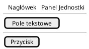
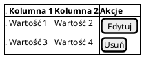
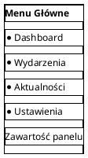
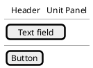
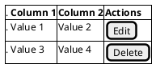
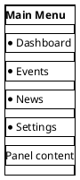

# Mock-upy Paneli Django / Django Panels Mock-ups

## 🇵🇱 Po Polsku

### ✅ Status: STWORZONE

**Ten katalog zawiera kompletne mock-upy paneli Django przygotowane w PlantUML.**

### Zakres Mock-upów

Mock-upy w tym katalogu dotyczą **paneli webowych Django** przeznaczonych dla:
1. **Jednostek organizacyjnych** - zarządzanie treściami jednostki
2. **Administratorów merytorycznych** - zarządzanie całym systemem (nie Django Admin)

### Wymagania Techniczne

**Format**: PlantUML salt/wireframe
**Technologia docelowa**: Django Template Language (DTL)
**Architektura**: Bezpośrednia implementacja w Django (bez warstwy API)

### Struktura Katalogów

```
docs/mock_django/
├── README.md                        # Ten plik
├── unit_panel/                      # Mock-upy panelu jednostek
│   ├── unit_panel_overview.puml     # Przegląd panelu
│   ├── event_management.puml        # Zarządzanie wydarzeniami
│   ├── announcement_management.puml # Zarządzanie aktualnościami
│   ├── statistics_view.puml         # Widok statystyk
│   └── user_management.puml         # Zarządzanie użytkownikami jednostki
├── admin_panel/                     # Mock-upy panelu administratora merytorycznego
│   ├── admin_dashboard.puml         # Dashboard administratora
│   ├── content_moderation.puml      # Moderacja treści
│   ├── unit_management.puml         # Zarządzanie jednostkami
│   ├── global_statistics.puml       # Globalne statystyki
│   ├── system_configuration.puml    # Konfiguracja systemu
│   └── permissions_management.puml  # Zarządzanie uprawnieniami
└── common/                          # Wspólne elementy
    ├── navigation.puml              # Nawigacja
    ├── forms.puml                   # Formularze
    └── components.puml              # Komponenty wielokrotnego użytku
```

### Panel dla Jednostek Organizacyjnych

**Grupa docelowa**: Pracownicy jednostek organizacyjnych PW

**Funkcjonalności**:
- Zarządzanie wydarzeniami organizowanymi przez jednostkę
- Publikowanie aktualności jednostki
- Przeglądanie statystyk i raportów jednostki
- Zarządzanie użytkownikami jednostki
- Konfiguracja uprawnień i widoczności treści

**Technologia**:
- Django views (Class-Based Views)
- Django Template Language (DTL)
- Django ORM (bezpośredni dostęp do modeli)
- **Bez warstwy API** - całość logiki renderowana bezpośrednio w Django

### Panel Administratora Merytorycznego

**Grupa docelowa**: Administratorzy merytoryczni/organizacyjni (nietechniczni)

**Funkcjonalności**:
- Zaawansowane zarządzanie wszystkimi treściami systemu
- Zarządzanie wszystkimi jednostkami organizacyjnymi
- Przegląd globalnych statystyk i raportów
- Moderacja zgłoszeń i raportów użytkowników
- Konfiguracja systemowa dostępna dla administratorów merytorycznych
- Zarządzanie uprawnieniami użytkowników w całym systemie

**Technologia**:
- Django views (Class-Based Views)
- Django Template Language (DTL)
- Django ORM (bezpośredni dostęp do modeli)
- **NIE Django Admin** - dedykowany interfejs dla użytkowników nietechnicznych
- **Bez warstwy API** - całość logiki renderowana bezpośrednio w Django

**Różnice względem Django Admin**:
- Interfejs dostosowany do potrzeb PW
- Pełna zgodność z WCAG 2.1
- Wielojęzyczność (PL/EN) dostosowana do kontekstu
- UX przyjazny dla użytkowników nietechnicznych
- Tylko potrzebne funkcje biznesowe (bez zaawansowanych funkcji technicznych)

### Format Mock-upów: PlantUML Salt

**Wszystkie mock-upy zostały stworzone w formacie PlantUML z wykorzystaniem składni salt/wireframe.**

#### Przykład Podstawowy



#### Przykład z Tabelą



#### Przykład z Menu



### Wymagania dla Mock-upów

Każdy mock-up musi:
- ✅ Być w formacie PlantUML salt
- ✅ Mieć czytelną strukturę i opisy elementów
- ✅ Uwzględniać zasady dostępności (WCAG 2.1)
- ✅ Używać polskich nazw dla elementów interfejsu
- ✅ Zawierać przykładowe dane reprezentatywne dla PW
- ✅ Być spójny z istniejącymi wzorcami Django
- ✅ Zawierać opis funkcjonalności w komentarzach

### Jak Aktualizować Mock-upy

1. **Skopiuj szablon** z przykładów w [`docs/MOCKUPY.md`](../MOCKUPY.md)
2. **Dostosuj do konkretnego widoku** (np. lista wydarzeń, formularz edycji)
3. **Dodaj przykładowe dane** reprezentatywne dla PW
4. **Oznacz elementy interaktywne** (przyciski, linki, formularze)
5. **Dodaj komentarze** wyjaśniające złożone funkcjonalności
6. **Zweryfikuj dostępność** - czy wszystkie elementy są opisane?
7. **Zapisz w odpowiednim katalogu** (unit_panel lub admin_panel)

### Generowanie Obrazów z PlantUML

```bash
# Instalacja PlantUML (jeśli jeszcze nie zainstalowane)
# Wymagana Java

# Generowanie obrazu z pliku .puml
plantuml mock_django/unit_panel/event_management.puml

# Generowanie wszystkich plików w katalogu
plantuml mock_django/**/*.puml

# Używanie edytora online
# https://www.plantuml.com/plantuml/uml/
```

### Integracja z VS Code

**Rozszerzenie**: PlantUML (jebbs.plantuml)

**Funkcje**:
- Podgląd na żywo
- Eksport do PNG/SVG
- Autouzupełnianie składni
- Walidacja błędów

---

## 🇬🇧 In English

### ✅ Status: CREATED

**This directory contains a complete set of Django panel mock-ups prepared in PlantUML.**

### Scope of Mock-ups

Mock-ups in this directory relate to **Django web panels** intended for:
1. **Organizational units** - managing unit content
2. **Content administrators** - managing the entire system (not Django Admin)

### Technical Requirements

**Format**: PlantUML salt/wireframe
**Target technology**: Django Template Language (DTL)
**Architecture**: Direct Django implementation (without API layer)

### Directory Structure

```
docs/mock_django/
├── README.md                        # This file
├── unit_panel/                      # Mock-ups for unit panel
│   ├── unit_panel_overview.puml     # Panel overview
│   ├── event_management.puml        # Event management
│   ├── announcement_management.puml # Announcement management
│   ├── statistics_view.puml         # Statistics view
│   └── user_management.puml         # Unit user management
├── admin_panel/                     # Mock-ups for content administrator panel
│   ├── admin_dashboard.puml         # Administrator dashboard
│   ├── content_moderation.puml      # Content moderation
│   ├── unit_management.puml         # Unit management
│   ├── global_statistics.puml       # Global statistics
│   ├── system_configuration.puml    # System configuration
│   └── permissions_management.puml  # Permissions management
└── common/                          # Common elements
    ├── navigation.puml              # Navigation
    ├── forms.puml                   # Forms
    └── components.puml              # Reusable components
```

### Organizational Unit Panel

**Target audience**: Staff of PW organizational units

**Functionality**:
- Managing events organized by the unit
- Publishing unit announcements
- Viewing unit statistics and reports
- Managing unit users
- Configuring permissions and content visibility

**Technology**:
- Django views (Class-Based Views)
- Django Template Language (DTL)
- Django ORM (direct model access)
- **Without API layer** - all logic rendered directly in Django

### Content Administrator Panel

**Target audience**: Content/organizational administrators (non-technical)

**Functionality**:
- Advanced management of all system content
- Management of all organizational units
- Overview of global statistics and reports
- Moderation of user reports and submissions
- System configuration accessible to content administrators
- User permissions management across the system

**Technology**:
- Django views (Class-Based Views)
- Django Template Language (DTL)
- Django ORM (direct model access)
- **NOT Django Admin** - dedicated interface for non-technical users
- **Without API layer** - all logic rendered directly in Django

**Differences from Django Admin**:
- Interface tailored to PW needs
- Full WCAG 2.1 compliance
- Multilingual support (PL/EN) adapted to context
- UX friendly for non-technical users
- Only needed business features (without advanced technical features)

### Mock-up Format: PlantUML Salt

**All mock-ups have been created in PlantUML format using salt/wireframe syntax.**

#### Basic Example



#### Example with Table



#### Example with Menu



### Requirements for Mock-ups

Each mock-up must:
- ✅ Be in PlantUML salt format
- ✅ Have clear structure and element descriptions
- ✅ Consider accessibility principles (WCAG 2.1)
- ✅ Use Polish names for interface elements
- ✅ Contain sample data representative for PW
- ✅ Be consistent with existing Django patterns
- ✅ Include functionality descriptions in comments

### How to Update Mock-ups

1. **Copy template** from examples in [`docs/MOCKUPY.md`](../MOCKUPY.md)
2. **Customize for specific view** (e.g., event list, edit form)
3. **Add sample data** representative for PW
4. **Mark interactive elements** (buttons, links, forms)
5. **Add comments** explaining complex functionality
6. **Verify accessibility** - are all elements described?
7. **Save in appropriate directory** (unit_panel or admin_panel)

### Generating Images from PlantUML

```bash
# Install PlantUML (if not already installed)
# Requires Java

# Generate image from .puml file
plantuml mock_django/unit_panel/event_management.puml

# Generate all files in directory
plantuml mock_django/**/*.puml

# Use online editor
# https://www.plantuml.com/plantuml/uml/
```

### VS Code Integration

**Extension**: PlantUML (jebbs.plantuml)

**Features**:
- Live preview
- Export to PNG/SVG
- Syntax autocompletion
- Error validation

---

## 📚 Related Documentation / Powiązana Dokumentacja

- **Full mock-ups documentation / Pełna dokumentacja mock-upów**: [`docs/MOCKUPY.md`](../MOCKUPY.md)
- **Flutter app mock-ups / Mock-upy aplikacji Flutter**: [`docs/mock/`](../mock/index.rst)
- **Requirements / Wymagania**: [`docs/docs.md`](../docs.md)
- **Functional specification / Specyfikacja funkcjonalna**: [`docs/specs.md`](../specs.md)
- **PlantUML Salt Documentation**: https://plantuml.com/salt

---

**Created / Utworzono**: 2026-01-13

**Version / Wersja**: 1.0

**Status**: ✅ Mock-ups completed / Mock-upy ukończone
