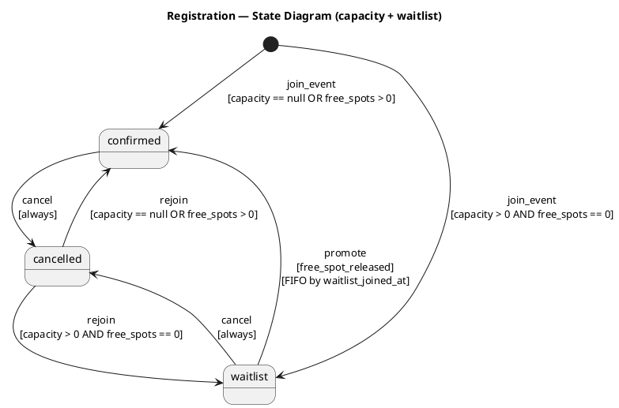

# Specyfikacja funkcjonalna
## Aplikacja Companion dla Politechniki Warszawskiej

> **📋 Uwaga dotycząca mock-upów i interfejsów użytkownika**: 
> - Mock-upy w `docs/mock/` dotyczą **wyłącznie aplikacji mobilnej Flutter dla studentów** (Android/iOS)
> - Panele administracyjne Django (dla jednostek i administratorów merytorycznych) są implementowane bezpośrednio w Django z użyciem Django Template Language (DTL), **bez warstwy API**
> - Backend udostępnia REST API (DRF) **wyłącznie dla aplikacji mobilnej**; panele Django nie są konsumentami API
> - Szczegółowe informacje o brakujących mock-upach i wymaganiach dla paneli Django: [`docs/MOCKUPY.md`](MOCKUPY.md)

> **🧭 Nazewnictwo**: **Aplikacja Companion** to oficjalna nazwa projektu. **PW_hub** to robocza/deweloperska nazwa aplikacji powstającej w ramach projektu. Nazwa marketingowa produktu nie została jeszcze ustalona.

---

## 1. Informacje ogólne

### 1.1 Cel dokumentu
Celem niniejszej specyfikacji funkcjonalnej jest szczegółowe opisanie funkcjonalności aplikacji mobilnej *Companion dla Politechniki Warszawskiej*, w sposób umożliwiający jej jednoznaczną implementację, testowanie oraz ocenę w ramach projektu IPI.

### 1.2 Zakres systemu
System składa się z dwóch głównych interfejsów:
1. **Aplikacja mobilna Flutter** - narzędzie informacyjno-organizacyjne dla studentów wspierające życie studenckie
2. **Panele webowe Django** - interfejsy zarządzania dla jednostek organizacyjnych i administratorów merytorycznych

System nie zastępuje systemów dydaktycznych (USOS), a jedynie (docelowo) integruje i prezentuje kluczowe informacje.

> **Uwaga:** Niektóre funkcjonalności opisane w tym dokumencie (Mapy, USOS) zostały **odłożone poza zakres MVP**. Patrz: sekcje 3.7, 3.8 oraz dokument `docs/deferred_tasks.md`.

### 1.3 Platformy
**Aplikacja mobilna (studenci):**
- Android
- iOS

**Panele webowe (jednostki i administratorzy):**
- Przeglądarka webowa (desktop)
- Django Template Language (DTL)
- Bez warstwy REST API po stronie paneli - bezpośrednia komunikacja z bazą danych przez Django ORM

**Backend / Mobile API:**
- REST API w Django REST Framework
- Kontrakt przeznaczony wyłącznie dla aplikacji mobilnej (Flutter)
- Panele Django nie korzystają z tego API

---

## 1.4 Standardy UI dla paneli webowych (vertical rhythm)

### Inwentaryzacja niespójności (karty/sekcje/formularze)
- **Karty list**: `content-card` (listy wydarzeń, aktualności, przewodników, jednostek) mają różne odstępy między tytułem, meta i opisem w zależności od widoku (np. listy wydarzeń i aktualności).  
- **Karty rozbudowane**: `announcement-card` i `event-card` stosują różne wartości paddingu i odstępów między nagłówkiem, treścią i meta.  
- **Sekcje szczegółów**: `event-section-title` oraz `unit-detail-section` mają różne wartości `margin-bottom`, co rozrywa rytm pionowy w opisach i listach.  
- **Formularze**: odstępy między `label`, polem i help/error text są niespójne (szczególnie w formularzach admina merytorycznego i panelu jednostki, gdzie część pól nie korzysta z tych samych wrapperów).

### Reguły spacingu i rytmu pionowego
**Bazowa jednostka rytmu:** 4px (0.25rem) z progresją w tokenach spacingu.

**Tokeny spacingu (CSS variables):**
- `--pw-space-1`: 0.25rem
- `--pw-space-2`: 0.5rem
- `--pw-space-3`: 0.75rem
- `--pw-space-4`: 1rem
- `--pw-space-5`: 1.5rem
- `--pw-space-6`: 2rem

**Reguły dla kart i sekcji:**
- nagłówek → treść: `--pw-space-3` lub `--pw-space-4` w zależności od komponentu (karty bazowe korzystają z `card-header + card-body`),
- treść → akcje/stopka: `--pw-space-3`,
- odstępy między blokami treści (meta/tekst/listy): `--pw-space-2`.

**Reguły dla formularzy:**
- label → field: `--pw-space-2`,
- field → help/error: `--pw-space-1`,
- grupa pól → akcje: `--pw-space-4`.

**Wyjątki:**
- Brak trybu „dense” w standardzie bazowym; jeśli pojawi się potrzeba, musi być jawnie oznaczony klasą pomocniczą.

## 2. Role użytkowników

### 2.1 Student (aplikacja mobilna Flutter)
- przegląda aktualności i wydarzenia,
- zapisuje się na wydarzenia,
- otrzymuje powiadomienia,
- korzysta z map kampusu.

### 2.2 Organizator/Pracownik jednostki (panel webowy Django)
- tworzy i edytuje wydarzenia przypisane do jednostki,
- zarządza zapisami na wydarzenia,
- przegląda listę uczestników,
- tworzy i wysyła do moderacji aktualności jednostki,
- dostęp przez panel Django (DTL, bez API).

### 2.3 Administrator merytoryczny (panel webowy Django)
- zarządza użytkownikami i rolami,
- moderuje treści ze wszystkich jednostek,
- zatwierdza/odrzuca i publikuje aktualności,
- konfiguruje integracje,
- przegląda globalne statystyki,
- zarządza wszystkimi jednostkami organizacyjnymi,
- dostęp przez dedykowany panel Django (DTL, nie Django Admin, bez API).

> **💡 Uwaga**: Panel administratora merytorycznego NIE wykorzystuje standardowego Django Admin. Jest to dedykowany interfejs zbudowany przy użyciu Django views i templates, zaprojektowany specjalnie dla administratorów nietechnicznych z pełną zgodnością WCAG 2.1.
> Szczegółowy kontrakt dostępności (WCAG 2.1 AA) dla tego panelu: `docs/accessibility/wcag-admin-panel.md`.

---

## 3. Funkcjonalności

## 3.1 Rejestracja i logowanie

### Opis
Użytkownik loguje się do aplikacji przy użyciu konta uczelnianego.

### Wymagania funkcjonalne
- logowanie SSO,
- automatyczne przypisanie roli,
- brak lokalnych haseł.

---

## 3.1.1 Onboarding profilu studenta (P1)

### Cel
Krótki onboarding zbiera minimalne dane potrzebne do personalizacji treści
bez rozbudowanego procesu rejestracji.

### Zakres (MVP/P1)
- wybór **wydziału** (wymagane),
- wybór **roku studiów** (wymagane),
- wybór **grupy** (opcjonalne, tylko jeśli dane dostępne),
- onboarding uruchamiany przy **pierwszym wejściu** po rejestracji/logowaniu,
  dopóki profil nie zostanie uzupełniony.

### Zasady UX
- maksymalnie 1–3 kroki,
- możliwość pominięcia **tylko** pola grupy (albo całego onboardingu, jeśli dane słownikowe są niepełne),
- brak konta lokalnego i brak integracji z USOS w tym kroku.

### Model danych (profil studenta)
Profil studenta przechowuje:
- `faculty` (wymagane),
- `study_year` (wymagane),
- `study_group` (opcjonalne).

Model musi umożliwiać **późniejszą edycję** danych (poza zakresem implementacji P1).

### Personalizacja treści (konsumenci danych)
Zapisane dane profilu wpływają na:
- **Listę wydarzeń** – domyślny filtr po wydziale (możliwa zmiana filtra przez użytkownika),
- **Plan / inne moduły personalizowane** – jeśli moduł istnieje, wykorzystuje te same pola.

W przypadku braku profilu system wyświetla **treści ogólne** bez domyślnej personalizacji.

### Zależności danych
Onboarding korzysta ze słowników:
- wydziały (wymagane),
- lata studiów (wymagane),
- grupy (opcjonalne, zależne od wydziału/roku).

W razie braków w słownikach: onboarding dopuszcza pominięcie grupy lub oferuje
tymczasowy wybór „Nie wiem / później”.

### Ryzyka i mitigacje
- **Ryzyko:** zbyt długi onboarding → **Mitigacja:** maks. 1–3 kroki.
- **Ryzyko:** niepełne słowniki → **Mitigacja:** opcja „pomiń” dla grupy i fallback na treści ogólne.

### Metryka sukcesu (P1)
- ≥70% nowych użytkowników kończy onboarding w pierwszej sesji.

---

## 3.2 System aktualności

### Opis
Centralny strumień informacji publikowanych przez uczelnię i organizacje.

### Funkcje
- lista aktualności,
- filtrowanie po kategorii,
- oznaczanie jako przeczytane,
- atrybut języka (PL/EN) - brak pełnych tłumaczeń 1:1 w MVP.

### 3.2.1 Zasady publikacji i moderacji aktualności (kontrakt domenowy)
Reguły publikacji i moderacji aktualności są zdefiniowane w dokumencie
`docs/analysis/news-publication-moderation.md` i stanowią **jednoznaczny
workflow akceptacji** pomiędzy autorem a administratorem merytorycznym.

---

## 3.3 Kalendarz wydarzeń

### Opis
Moduł prezentujący wydarzenia studenckie.

### Funkcje
- widok listy (porządek chronologiczny),
- filtrowanie łączone (wydział/jednostka, kategoria, zakres dat),
- szybkie filtry dat: dziś / ten tydzień / ten miesiąc,
- zakres niestandardowy (data od–do),
- licznik wyników aktualizowany po zmianie filtrów,
- czytelny stan „brak wydarzeń”,
- możliwość wyczyszczenia filtrów przy pustych wynikach,
- stany: ładowania i błędu pobierania,
- szczegóły wydarzenia.

### Zakres P1 (odkrywanie wydarzeń)
- **IN:** lista wydarzeń + filtrowanie + szczegóły.
- **OUT:** zapisy, wejściówki i rejestracja w aplikacji.
- Moduł listy jest gotowy do rozszerzenia o inne widoki (np. siatka kalendarza) w przyszłości.

---

## 3.4 Szczegóły wydarzenia

### Zakres informacji
- tytuł i opis,
- data i zakres dat,
- lokalizacja,
- organizator (jednostka),
- kategorie / tagi,
- dostępność:
  - architektoniczna,
  - sensoryczna,
  - informacja o języku wydarzenia (atrybut PL/EN).

### Zakres P1 (odkrywanie wydarzeń)
- **IN:** pełny opis, data, lokalizacja, organizator, kategorie/tags.
- **OUT:** zapisy, bilety, QR.

---

## 3.5 Zapisy na wydarzenia

### Opis
Obsługa rejestracji uczestników.

### Funkcje
- zapisz / wypisz się,
- limit miejsc,
- lista uczestników (organizator),
- generowanie wejściówek QR.

### 3.5.1 Zasady limitów miejsc i obsługi listy oczekujących (waitlist)

> Zakres: **tylko logika domenowa** rejestracji i limitów. Bez UI, QR, endpointów i powiadomień.

#### Założenia (Product Questmaster)
- Rejestracja jest możliwa wyłącznie, gdy `event.registration_required == true` oraz `event.is_registration_open() == true`.
- Limit miejsc (`event.capacity`) dotyczy **tylko** rejestracji ze statusem zajmującym miejsce.
- System nie dopuszcza duplikatów rejestracji dla tej samej pary `event + user` (unikalny kontrakt).
- Wszystkie reguły muszą być deterministyczne i testowalne (Creed of Truth).

#### Statusy rejestracji (Registration)
Na podstawie modelu `Registration`:

| Status | Opis | Zajmuje miejsce? |
|---|---|---|
| `confirmed` | Użytkownik ma aktywne miejsce na wydarzeniu. | **Tak** |
| `waitlist` | Użytkownik oczekuje na wolne miejsce. | **Nie** |
| `cancelled` | Rejestracja zakończona z inicjatywy użytkownika lub systemu. | **Nie** |

#### Diagram stanów (Registration) — PlantUML


#### Reguły zapisu (join event)
1) **Brak limitu (`event.capacity == null`)**  
   - Rejestracja **zawsze** otrzymuje status `confirmed`.
2) **Limit > 0 i są wolne miejsca** (`confirmed_count < capacity`)  
   - Rejestracja otrzymuje status `confirmed`.
3) **Limit > 0 i brak wolnych miejsc** (`confirmed_count >= capacity`)  
   - Rejestracja otrzymuje status `waitlist`.
4) **Limit = 0**  
   - Rejestracja **zawsze** otrzymuje status `waitlist` (jeśli zapisy są otwarte).
5) **Duplikat zapisu (ten sam `user + event`)**  
   - System **nie tworzy** drugiego rekordu.  
   - Jeśli istnieje `confirmed` lub `waitlist` → zwracany jest istniejący status (idempotentna odpowiedź, bez zmiany).  
   - Jeśli istnieje `cancelled` → traktować jako **nowy zapis** zgodnie z regułami 1–4 (nowa kolejność, nowy czas zapisu).

#### Reguły wypisu (rezygnacja)
- Rezygnacja z `confirmed` → status `cancelled`, miejsce zwalnia się **natychmiast**.
- Rezygnacja z `waitlist` → status `cancelled`, **nie** wpływa na limit miejsc.
- Rezygnacja jest zawsze możliwa, jeśli rejestracja istnieje.

#### Waitlist — definicja i kolejność
- Waitlist to **logiczna kolejka** rejestracji z `status = waitlist`.
- Kolejność jest **FIFO**.  
- Pole determinujące kolejność: `waitlist_joined_at` rozumiane jako **czas ustawienia statusu `waitlist`**.  
  - Jeżeli system przechowuje tylko `registered_at`, to **musi** go traktować jako czas dołączenia do waitlist.  
- Tie-breaker (ten sam czas): **niższy `Registration.id` wygrywa**.
- Użytkownik może samodzielnie wypisać się z waitlist (`status -> cancelled`).
- Użytkownik może ponownie zapisać się po rezygnacji (`cancelled -> confirmed/waitlist`), ale **traci** poprzednią pozycję w kolejce.

#### Zwolnienie miejsca i priorytety (promocja z waitlist)
1) Gdy miejsce się zwalnia (np. `cancelled` z `confirmed` lub zwiększenie `capacity`):
   - System wybiera **pierwszą** rejestrację z waitlist zgodnie z FIFO.
2) Awans z waitlist jest **automatyczny** i natychmiastowy (bez dodatkowej akcji użytkownika).
3) Awans **nie może** pomijać kolejki — brak „ręcznych” priorytetów w MVP.
4) Determinizm i odporność na race condition:
   - Decyzja o awansie musi być wykonywana **atomowo** (jedno wolne miejsce → maks. jeden awans).
   - W przypadku jednoczesnych zapisów/zwolnień, obowiązuje jednoznaczne rozstrzygnięcie wg kolejności FIFO + tie-breaker `id`.

#### Plan testów (QA Witcher — Given/When/Then)
1) **Zapis przy wolnych miejscach**  
   Given event z `capacity = 10` i `confirmed_count = 9`  
   When user wykonuje join  
   Then status = `confirmed` i `confirmed_count` wzrasta do 10.
2) **Zapis przy braku miejsc → waitlist**  
   Given event z `capacity = 10` i `confirmed_count = 10`  
   When user wykonuje join  
   Then status = `waitlist`, `confirmed_count` bez zmian.
3) **Rezygnacja z aktywnego miejsca**  
   Given user z `status = confirmed`  
   When user rezygnuje  
   Then status = `cancelled` i miejsce zwalnia się natychmiast.
4) **Automatyczny awans z waitlist**  
   Given waitlist FIFO z co najmniej 1 osobą  
   When zwalnia się miejsce  
   Then najstarszy `waitlist` przechodzi na `confirmed`.
5) **Rezygnacja z waitlist**  
   Given user z `status = waitlist`  
   When user rezygnuje  
   Then status = `cancelled`, kolejność waitlist pozostałych nie zmienia się.
6) **Duplikat zapisu**  
   Given istnieje `confirmed` lub `waitlist` dla `user + event`  
   When user wykonuje join ponownie  
   Then system zwraca istniejący status i nie tworzy nowego rekordu.
7) **Edge-case: capacity = 1, szybkie zapisy/wycofania**  
   Given event z `capacity = 1`  
   When dwóch użytkowników rejestruje się równolegle i jeden rezygnuje  
   Then tylko jeden ma `confirmed`, drugi `waitlist`, a po rezygnacji następuje deterministyczny awans FIFO.

#### Notatka decyzyjna (Product Questmaster)
Specyfikacja źródłowa nie definiowała:
- czy waitlist ma kolejność FIFO i jakie pole ją wyznacza,
- czy rezygnacja zwalnia miejsce natychmiast,
- czy duplikat zapisu jest dopuszczalny i jak go obsłużyć,
- czy awans z waitlist jest automatyczny.

Decyzje rozstrzygające:
- **FIFO** po czasie dołączenia do waitlist, z tie-breakerem `Registration.id`.
- Rezygnacja z `confirmed` zwalnia miejsce **natychmiast**.
- Duplikaty są zabronione, a ponowny zapis po `cancelled` traktowany jest jako **nowy** zapis.
- Awans z waitlist jest **automatyczny** i deterministyczny.

---

## 3.6 Wejściówki

### Opis
Cyfrowa forma potwierdzenia zapisu na wydarzenie. Wejściówka zawiera unikalny kod QR umożliwiający weryfikację uczestnictwa przez organizatora.

### Status architektoniczny API wejściówek
- API wejściówek jest częścią backendu (DRF) i służy **wyłącznie aplikacji mobilnej**.
- Panele Django **nie** korzystają z endpointów `/api/tickets/*` i nie posiadają własnej warstwy API.
- Kontrakt API wejściówek nie jest publiczny dla zewnętrznych klientów poza aplikacją mobilną.

### Funkcje
- **unikalny kod QR** - każda wejściówka posiada unikalny kod UUID, który jest zapisywany jako kod QR,
- **podgląd offline** - wejściówka może być pobrana do urządzenia mobilnego wraz z kodem QR w formacie base64,
- **weryfikacja przez organizatora** - organizator może zeskanować kod QR i zweryfikować ważność wejściówki.

### Szczegóły techniczne

#### Model danych
Wejściówka (Ticket) jest powiązana 1:1 z rejestracją (Registration):
- **Registration**: powiązanie uczestnika (User) z wydarzeniem (Event)
  - status rejestracji (confirmed/cancelled/waitlist)
  - dane uczestnika (imię, email, numer ID)
  - notatki dodatkowe
- **Ticket**: cyfrowa wejściówka
  - unikalny kod UUID (ticket_code)
  - kod QR (obraz PNG generowany automatycznie)
  - data wystawienia (issued_at)
  - data skanowania (scanned_at)
  - flaga ważności (is_valid)

#### Generowanie kodu QR
- Kod QR jest automatycznie generowany przy utworzeniu wejściówki (via Django signals)
- Koduje UUID wejściówki dla łatwej weryfikacji
- Zapisywany jako plik PNG w katalogu `tickets/qr_codes/`
- Używana biblioteka: `qrcode` (wersja 8.0)

#### Granice odpowiedzialności API vs panele Django
**API (Backend / Mobile API) odpowiada za:**
- udostępnienie wejściówek i ich metadanych użytkownikowi końcowemu w aplikacji mobilnej,
- dostarczenie payloadu offline (base64) dla wejściówek,
- weryfikację wejściówek przez organizatora/staff w aplikacji mobilnej.

**Panele Django odpowiadają za:**
- zarządzanie wydarzeniami i zapisami w panelu (DTL),
- podgląd danych w panelach bez wykorzystania endpointów `/api/tickets/*`.

#### API Endpoints

**Pobieranie wejściówek użytkownika:**
```
GET /api/tickets/
```
Zwraca listę wejściówek zalogowanego użytkownika z pełnymi metadanymi wydarzenia.

**Szczegóły wejściówki:**
```
GET /api/tickets/{id}/
```
Zwraca szczegóły wejściówki wraz z:
- tytułem wydarzenia
- datą i czasem wydarzenia
- lokalizacją
- danymi uczestnika
- URL do kodu QR
- kodem QR w base64 (dla podglądu offline)

**Pobieranie dla offline:**
```
GET /api/tickets/{id}/download/
```
Endpoint dedykowany do pobrania wejściówki z kodem QR w base64 dla użycia offline.

Struktura odpowiedzi (Offline Bundle):
- `id` (int): ID wejściówki
- `ticket_code` (UUID): Kod wejściówki
- `is_valid` (bool): Status ważności
- `scanned_at` (datetime|null): Data skanowania
- `qr_code_base64` (string): Obraz QR w formacie base64 (PNG)
- `event_id` (int): ID wydarzenia
- `event_title` (string): Tytuł wydarzenia
- `event_start_time` (datetime): Data rozpoczęcia
- `event_end_time` (datetime): Data zakończenia
- `event_location` (string): Lokalizacja wydarzenia
- `participant_name` (string): Nazwa uczestnika

**Weryfikacja wejściówki (organizator):**
```
POST /api/tickets/verify/
Body: { "ticket_code": "uuid-string" }
```
Weryfikuje wejściówkę i oznacza ją jako zeskanowaną. Dostępne tylko dla:
- organizatora wydarzenia (created_by)
- użytkowników ze statusem staff

Walidacja:
- Sprawdza czy wejściówka istnieje
- Sprawdza czy użytkownik ma uprawnienia (organizer lub staff)
- Sprawdza czy wejściówka jest ważna (is_valid)
- Sprawdza czy nie została już wcześniej zeskanowana (scanned_at)
- Przy poprawnej weryfikacji - ustawia scanned_at na aktualny czas

Możliwe odpowiedzi:
- Sukces: `{"valid": true, "message": "...", "ticket": {...}, "scanned_at": "..."}`
- Błąd: `{"valid": false, "message": "..."}`

#### Uprawnienia
- Tylko właściciel rejestracji może przeglądać swoją wejściówkę
- Tylko organizator wydarzenia lub staff może weryfikować wejściówki
- Weryfikacja zapisuje timestamp skanowania i zapobiega wielokrotnemu użyciu

#### Właściciele endpointów wejściówek
**Właściciel:** Backend / Mobile API (Django REST Framework).  
**Konsumenci:** wyłącznie aplikacja mobilna (Flutter).

**Role i uprawnienia (na poziomie kontraktu API):**
- **Użytkownik końcowy (student)**: `GET /api/tickets/`, `GET /api/tickets/{id}/`, `GET /api/tickets/{id}/download/`.
- **Organizator wydarzenia**: `POST /api/tickets/verify/` (weryfikacja w aplikacji mobilnej).
- **Staff**: `POST /api/tickets/verify/` (weryfikacja w aplikacji mobilnej).

---

## 3.7 Feedback po wydarzeniu (MVP)

### Opis
Minimalny proces zbierania opinii po zakończeniu wydarzenia.

### Kiedy zbieramy feedback
- po zakończeniu wydarzenia + 2h,
- tylko dla uczestników ze statusem **obecny** (scan QR),
- brak zbierania feedbacku dla wydarzeń odwołanych i osób nieobecnych.

### Wejścia do formularza
- ekran „Oceń wydarzenie” w aplikacji mobilnej,
- dostęp z powiadomienia push (jeśli włączone),
- fallback z widoku „Moje wydarzenia / Historia”.

### Minimalny zakres pytań (MVP)
1. Ocena ogólna (1–5, wymagane),
2. Pytanie jednokrotnego wyboru „Co najbardziej wpłynęło na Twoją ocenę?” (tagi, opcjonalne),
3. Komentarz otwarty (opcjonalny, limit znaków).

### Ograniczenia i dostępność
- 1 feedback / user / event,
- formularz zgodny z WCAG 2.1 AA (klawiatura, fokus, etykiety, błędy),
- brak emaili w MVP,
- obsługa braku internetu (komunikat + możliwość ponownej próby).

---

## 3.8 Mapy kampusu (POST-MVP)

> **STATUS: ODŁOŻONE (MMF-2)**
> Ta funkcjonalność nie wchodzi w zakres MVP. Została opisana jako element docelowy (MMF).

### Opis
Nawigacja po kampusach PW.

### Funkcje (Target)
- mapa kampusu,
- wybór budynków,
- trasy piesze,
- trasy dostępne dla osób z ograniczeniami ruchowymi.

---

## 3.9 Integracja z USOS (POST-MVP)

> **STATUS: ODŁOŻONE (MMF-3)**
> Ta funkcjonalność nie wchodzi w zakres MVP. Została opisana jako element docelowy (MMF).

### Opis
Prezentacja informacji akademickich.

### Funkcje (Target)
- pobieranie terminów,
- przypomnienia,
- tryb tylko do odczytu.

---

## 3.10 Powiadomienia

### Rodzaje
- przypomnienia o wydarzeniach,
- nowe aktualności,
- ważne terminy z USOS.

---

## 4. Wymagania niefunkcjonalne

### 4.1 Dostępność
- zgodność z WCAG 2.1,
- opisy alternatywne,
- wsparcie czytników ekranu.

### 4.2 Wydajność
- czas odpowiedzi < 2s,
- obsługa wielu użytkowników.

### 4.3 Bezpieczeństwo
- RODO,
- szyfrowanie transmisji,
- kontrola uprawnień.

### 4.4 Obsługa błędów i przypadki negatywne (MVP)
- statusy HTTP spójne z kategorią błędu (400/403/404/409/5xx),
- brak ujawniania detali technicznych w odpowiedziach,
- błędy integracji zewnętrznych logowane po stronie serwera,
- szczegółowy plan scenariuszy negatywnych i formatów odpowiedzi znajduje się w:
  - `docs/negative-test-plan.md`.

---

## 5. Scenariusze użytkownika

### 5.1 Student zapisuje się na wydarzenie
1. Otwiera wydarzenie.
2. Sprawdza dostępność.
3. Kliknięcie „Zapisz się”.
4. Otrzymanie wejściówki.

### 5.2 Organizator publikuje wydarzenie
1. Dodaje wydarzenie.
2. Uzupełnia dostępność.
3. Publikuje wydarzenie.

---

## 6. Kryteria akceptacji
Szczegółowe, testowalne kryteria akceptacji dla kluczowych flow znajdują się w dokumencie: `docs/acceptance-criteria.md`.

---

## 7. Uwagi końcowe
Specyfikacja stanowi podstawę do implementacji MVP oraz dalszego rozwoju aplikacji.
